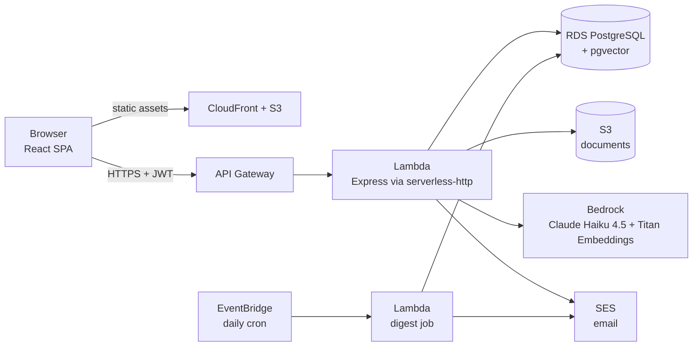

<div align="center">

# KnowledgeFlow AI

### Turn meetings and documents into decisions, tracked work and answers.

An AI-powered enterprise knowledge hub that reads what your team uploads, extracts what was **decided** and what needs to be **done**, puts a human in the loop to review it, and then lets everyone **ask questions** about the project in plain language.

<br/>


[Product tour](#-product-tour) · [How it works](#-how-it-works) · [Tech stack](#-tech-stack) · [Run it locally](#-running-locally) · [Technical report](docs/TECHNICAL_REPORT.md)

<br/>


</div>

<br/>

> **Built end to end by İnci Lal Dikmen** — frontend, backend, database, AI pipeline and AWS infrastructure — as a summer 2026 internship project.
>
> The internship has ended and the live AWS deployment has been decommissioned, so there is no hosted demo. The code here is the final deployed version; the tour below shows it running.

## 💡 The problem

Organisational knowledge is created in meetings and documents — and then it scatters. Decisions get re-argued, action items are forgotten, and new joiners can't reconstruct why anything was decided.

KnowledgeFlow AI connects the whole chain in one permissioned system:

<div align="center">

**Documents → Decisions → Tasks → Answers**

</div>

## ✨ Highlights

| | |
|---|---|
| 🧠 **AI extraction, human approval** | Every upload gets a summary, decisions and action items with source excerpts and confidence scores. Nothing counts until a manager confirms it. |
| 💬 **Chat grounded in your documents** | Retrieval-augmented answers with citations, scoped to the project — and an honest "I couldn't find this" instead of a guess. |
| ✅ **Real task tracking** | Confirmed action items become tasks with owners, deadlines, a lifecycle, notes and a full audit trail. |
| 🔐 **Two-level access control** | System role plus per-project role (manager / contributor / viewer), enforced on the server for every route. |
| 📊 **Risk and analytics** | Role-scoped dashboard, workload by owner, overdue rate and automatic project-risk scoring. |
| 🔗 **Shareable reports** | Public, expiring, read-only project briefs with one-click PDF export. |

**By the numbers:** 58 API endpoints · 15 database tables · 17 screens · ~16,000 lines of TypeScript · 9 AWS services

---

## 🧭 Product tour

A walk through the app in the order a team actually uses it.

### Getting set up

#### 1 · Sign in

Accounts are invite-only: there is no public sign-up page. An administrator creates each user, who then sets their own password through a one-time email link. Sessions are JWT-based.


#### 2 · Dashboard

The first thing you see after signing in, tailored to your role. Stat cards surface what needs attention — overdue tasks, upcoming deadlines, AI drafts waiting for review, high-risk projects — next to a live activity feed and a per-project risk overview.


#### 3 · User management

Administrators create, edit, deactivate and delete accounts, and see at a glance which projects each person belongs to. New users start as *pending* until they accept their invite.


#### 4 · Projects

Everything lives inside a project. Each card shows your role in it, how many tasks are confirmed, in progress and overdue, how many documents it holds, and a computed risk level. Filter by department or search by name.


#### 5 · Project detail

The home of a single project: headline numbers, description and members, with tabs for documents, tasks, members, recent activity and risk. Managers add people and assign roles from here, and can generate a shareable report.


### Capturing knowledge

#### 6 · Upload a document or transcript

Drag in a PDF, Word, PowerPoint or plain-text meeting transcript, pick the project and type, and start AI processing. The file goes to S3, its text is extracted, and Claude on Amazon Bedrock pulls out the summary, key decisions and action items with suggested owners and deadlines.


#### 7 · Documents & meetings

Every file you have access to, across your projects, with its type, uploader, date and processing status. Filter by type or status, or search by name.


#### 8 · Review what the AI extracted

The heart of the product. On the right, the AI's summary, decisions and action items — each with a confidence score and **Confirm / Edit / Reject** controls. On the left, the exact sentences from the source that each item was drawn from, so a reviewer can verify it in seconds. Everything stays a *draft* until a human approves it.


### Turning it into work

#### 9 · Action tracker

Confirmed action items land on a board that follows their lifecycle: Draft → Confirmed → In Progress → Completed, or Cancelled. Overdue tasks are highlighted, each card shows its owner, deadline and risk level, and you can switch to a table view or filter to your own work. (Shown here in the built-in dark theme.)


#### 10 · Task detail

Each task keeps its full story: owner, deadline, risk and status; a link back to the document and the sentence it came from; progress notes from the people doing the work; and a status history recording who changed what, and when.


### Asking and analysing

#### 11 · AI chat assistant

Ask a question about a project in plain language. The assistant searches that project's documents semantically, answers only from what it finds, and cites the source document inline. If the answer isn't in the documents, it says so rather than inventing one.


#### 12 · Insights

Analytics over the whole workspace: totals for documents, decisions and action items, activity over the last six months, task status and risk breakdowns, workload by owner, and the documents generating the most follow-up.


#### 13 · Project timeline

A chronological record of everything that happened in a project — uploads, confirmed summaries and decisions, and every task status change, with who did it. Filter to documents, tasks or decisions.


### Sharing

#### 14 · Generate a shareable report

One click creates a read-only report link for people outside the system. No sign-in is needed, and the link expires automatically after seven days.


#### 15 · The public project brief

What the recipient sees: a clean project brief with the overview numbers, the team, confirmed key decisions, open action items and recent activity — downloadable as a PDF generated on the server.


---

## ⚙️ How it works



**The core pipeline:** upload → text extraction → LLM extraction → human review → tracked work.

- **Extraction.** Claude Haiku 4.5 returns structured JSON. The backend treats it as untrusted: it parses defensively, clamps confidence values, validates dates and derives risk from the deadline, not from the model.
- **Retrieval.** Documents are chunked and embedded with Titan Text Embeddings V2 into pgvector (1024 dimensions, HNSW index). Chat combines semantic search with a keyword bonus, and the project-membership check is part of the vector query itself, so content you can't access is never even a candidate.
- **Serverless.** One Express app runs both locally (`src/index.ts`) and as a Lambda (`src/lambda.ts`). A second Lambda sends a daily email digest of overdue and upcoming tasks on an EventBridge schedule.

## 🛠 Tech stack

| Layer | Technologies |
|---|---|
| **Frontend** | React 19, TypeScript, Vite, React Router 7, Axios, hand-written CSS with light and dark themes |
| **Backend** | Node.js 20, Express 5, TypeScript, `pg` (raw SQL, no ORM), JWT + bcrypt, `multer`, `officeparser`, `pdfkit` |
| **Database** | PostgreSQL on Amazon RDS with pgvector |
| **AI** | Amazon Bedrock — Claude Haiku 4.5 for extraction and chat, Titan Text Embeddings V2 for search |
| **Infrastructure** | AWS Lambda, API Gateway, S3, CloudFront, SES, EventBridge, VPC, CloudWatch, Serverless Framework |

## 📁 Repository structure

```
backend/          Express + TypeScript API (also the Lambda package)
  src/routes/       route definitions, one file per resource
  src/handlers/     request handlers and business logic
  src/middleware/   JWT verification and role checks
  src/utils/        embeddings, text extraction, email, risk scoring, auth tokens
  src/jobs/         scheduled daily digest
  schema.sql        full PostgreSQL schema (15 tables + pgvector)
  serverless.yml    Lambda / API Gateway / IAM / schedule definition
frontend/         React + Vite single-page app
  src/pages/        one component per screen
  src/components/   shared UI components
  src/api/          Axios client (JWT injection, 401 handling)
docs/             technical report, technical reference, screenshots
sample-files/     example meeting transcripts to upload
```

## 🚀 Running locally

**Prerequisites:** Node.js 20+, PostgreSQL with the [pgvector](https://github.com/pgvector/pgvector) extension, and an AWS account with access to S3 and Bedrock (needed for upload, AI extraction and chat; the rest of the app works without them).

```bash
# 1. Database
createdb knowledgeflow_ai
psql -d knowledgeflow_ai -f backend/schema.sql

# 2. Backend  →  http://localhost:3001
cd backend
cp .env.example .env        # fill in DB, JWT and AWS settings
npm install
npx ts-node setup-test.ts   # optional: seeds test users and a sample project
npm run dev

# 3. Frontend  →  http://localhost:5173
cd ../frontend
cp .env.example .env
npm install
npm run dev
```

With `EMAIL_ENABLED=false` (the default), invite and password-reset links are returned in the API response instead of being emailed. Upload the transcripts in [`sample-files/`](sample-files/) to see the extraction pipeline in action.

Deployment to AWS is defined in [`backend/serverless.yml`](backend/serverless.yml) (`npm run build && npx serverless deploy --stage prod`); the VPC security-group and subnet IDs are read from environment variables listed in `backend/.env.example`.

## 📚 Documentation

| Document | What's inside |
|---|---|
| [**Technical Report**](docs/TECHNICAL_REPORT.md) | The full write-up: requirements, architecture, data model, API design, auth flows, engineering decisions, challenges and how they were solved. |
| [**Technical Reference**](docs/TECHNICAL_REFERENCE.md) | A concise reference to routes, schema, RBAC rules and deployment configuration. |

## 🔭 Known limitations

This is an MVP built in a fixed internship window. AI processing runs synchronously inside the request, so very large documents can hit the 30-second Lambda limit; scanned PDFs without a text layer are not supported (no OCR); and chat answers each question independently, without conversational memory. The technical report covers these and the planned improvements in detail.

---

<div align="center">

**İnci Lal Dikmen** · [github.com/laldikmen](https://github.com/laldikmen)

</div>
