# KnowledgeFlow AI

**An AI-powered enterprise knowledge hub.** Teams upload documents and meeting transcripts into a project; the system extracts a summary, the **decisions** that were made and the **action items** that were created, routes them through human review, tracks the resulting tasks, and answers questions about the project with a document-grounded AI chat.

Built end to end (frontend, backend, database, AWS infrastructure) by **İnci Lal Dikmen** as a summer 2026 internship project.


> **Project status.** The internship has ended and the live AWS deployment (`eu-central-1`) has been decommissioned, so there is no hosted demo. The code in this repository is the final deployed version and can be run locally — see [Running locally](#running-locally).

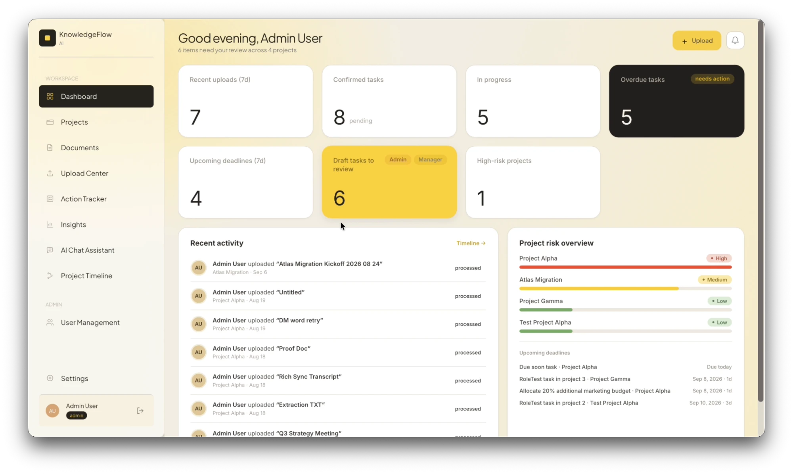

| AI extraction with human review | Document-grounded AI chat |
|---|---|
| 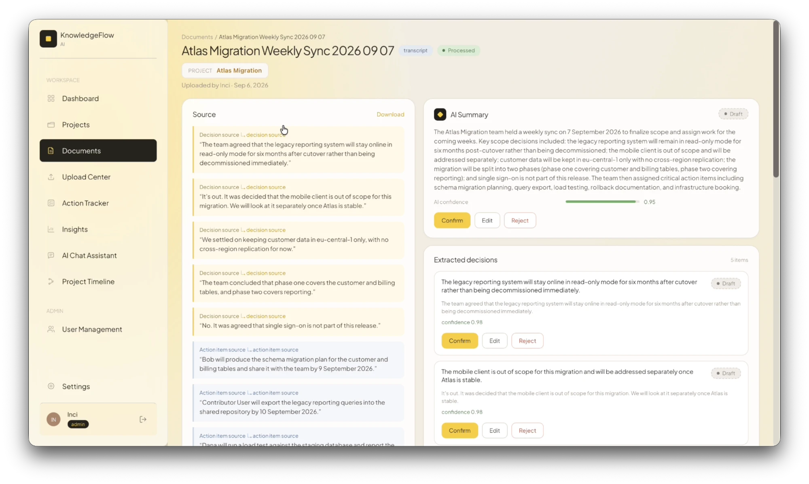 | 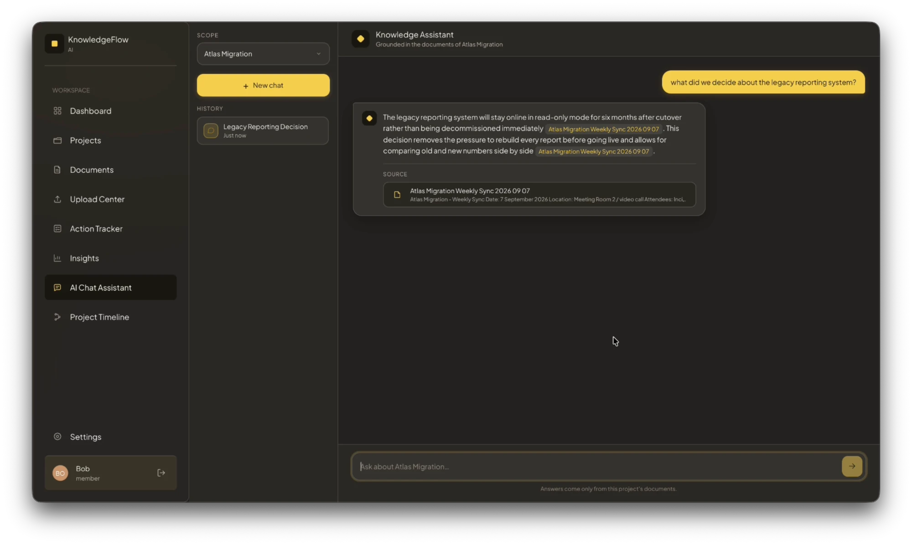 |

| Action tracker | Insights |
|---|---|
| 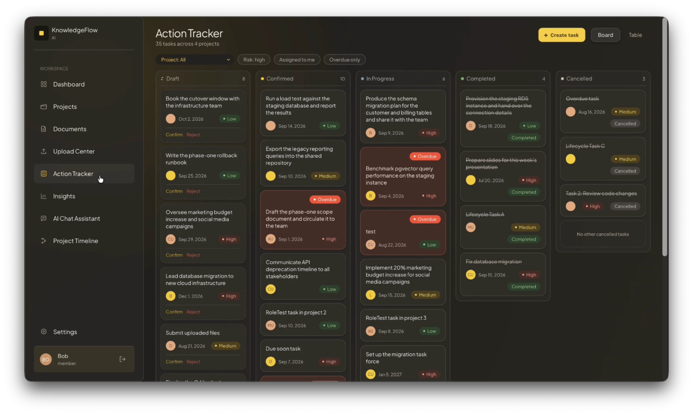 | 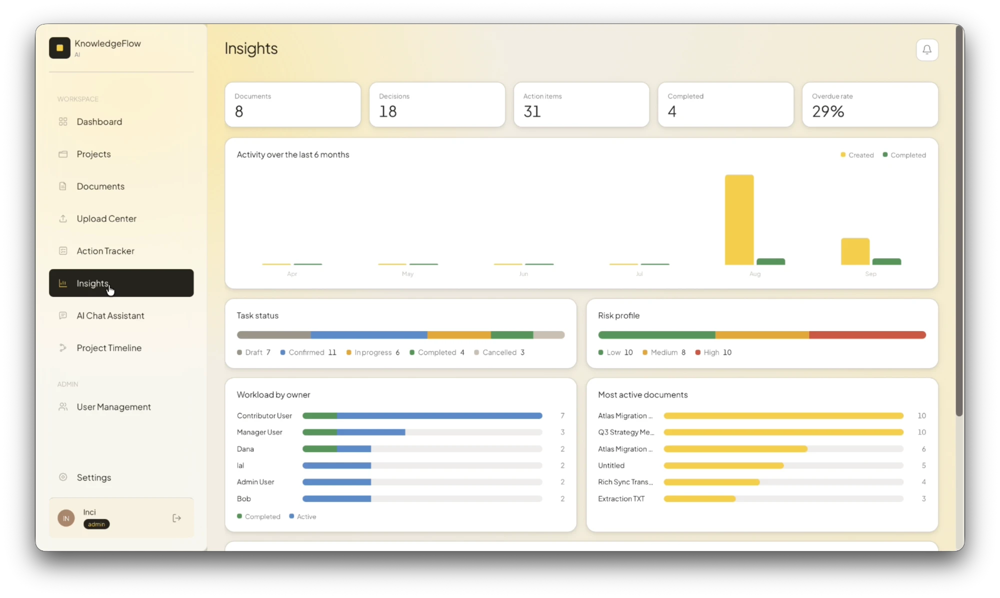 |

<details>
<summary><b>More screenshots</b></summary>

| | |
|---|---|
| Login<br/>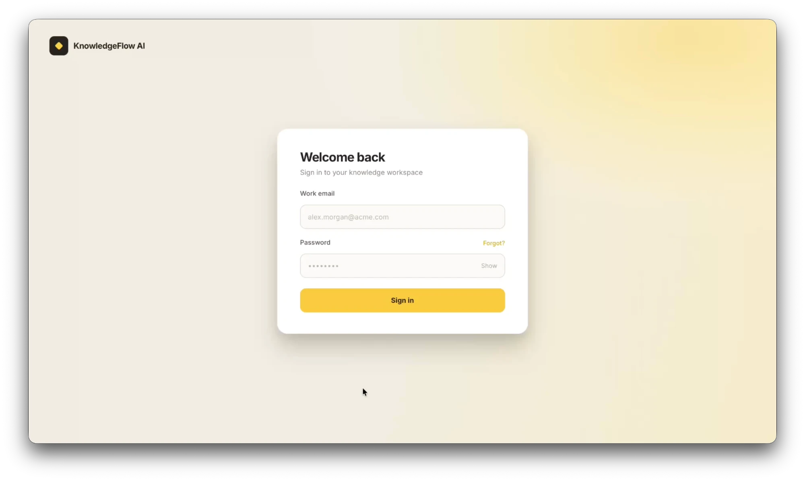 | User management<br/>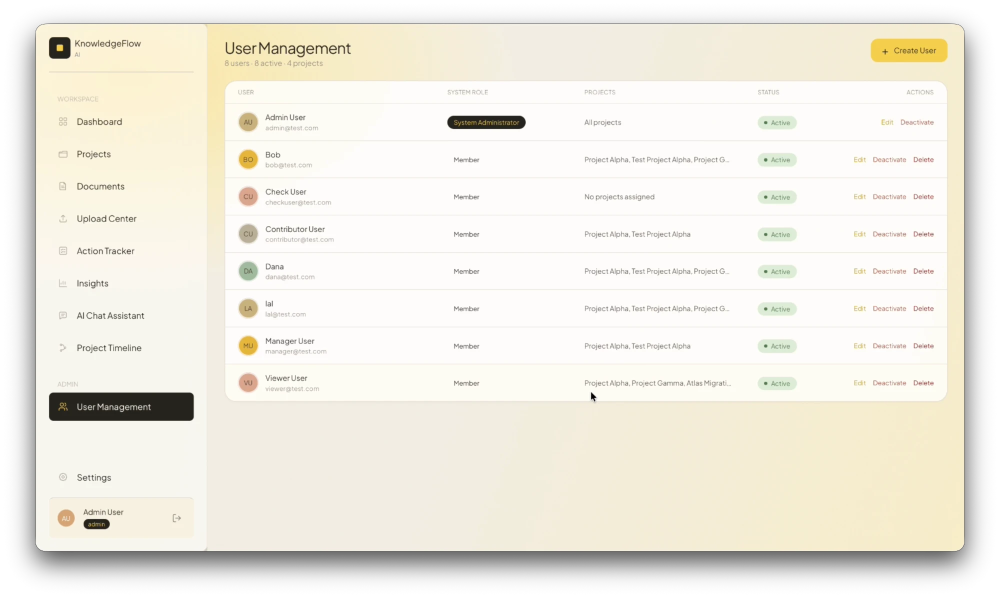 |
| Projects<br/>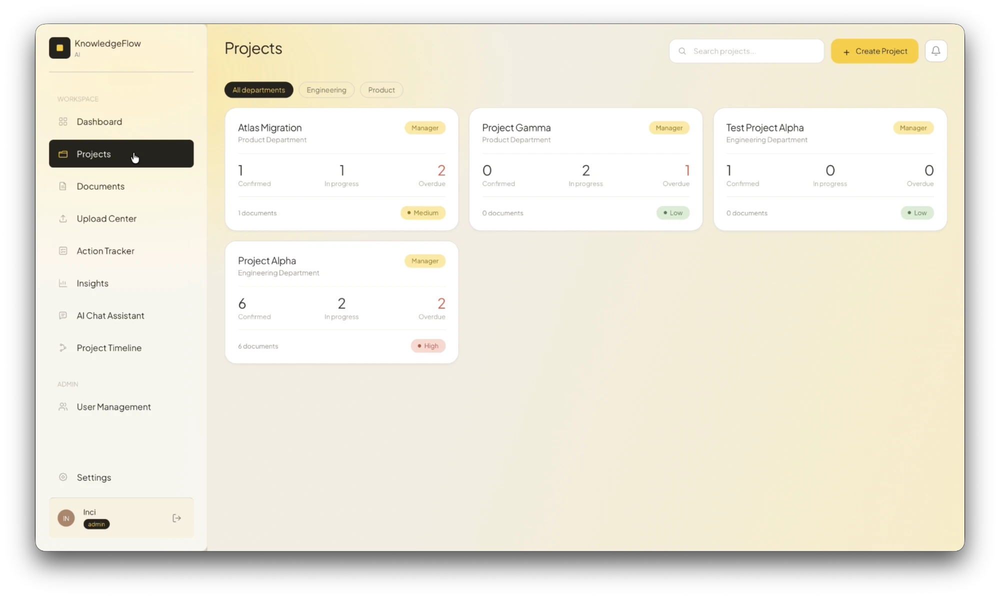 | Project detail<br/>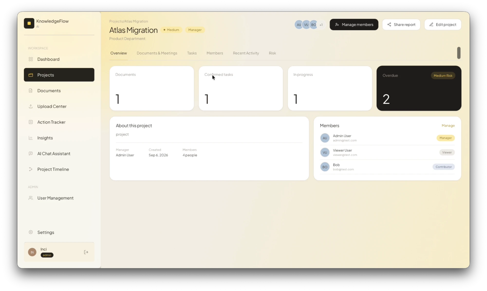 |
| Upload center<br/>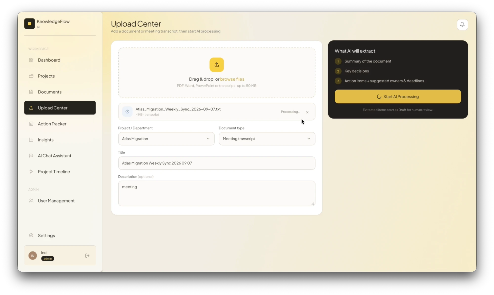 | Documents<br/>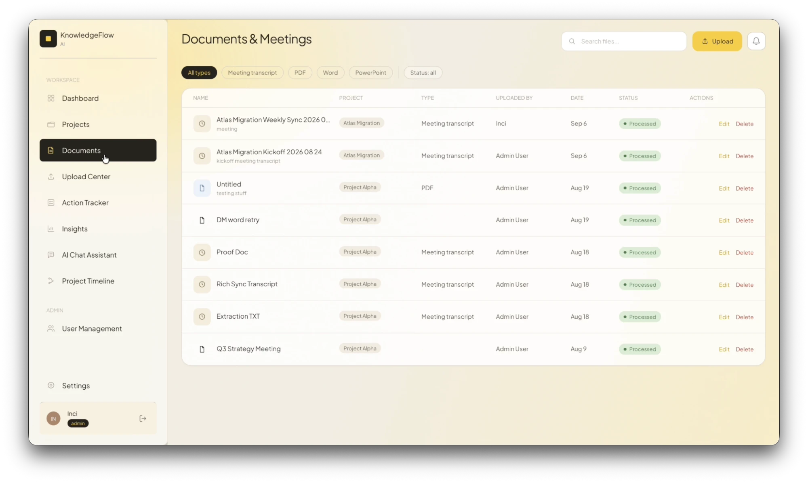 |
| Task detail<br/>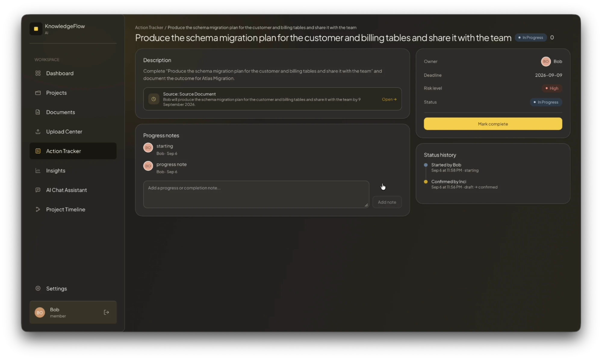 | Project timeline<br/>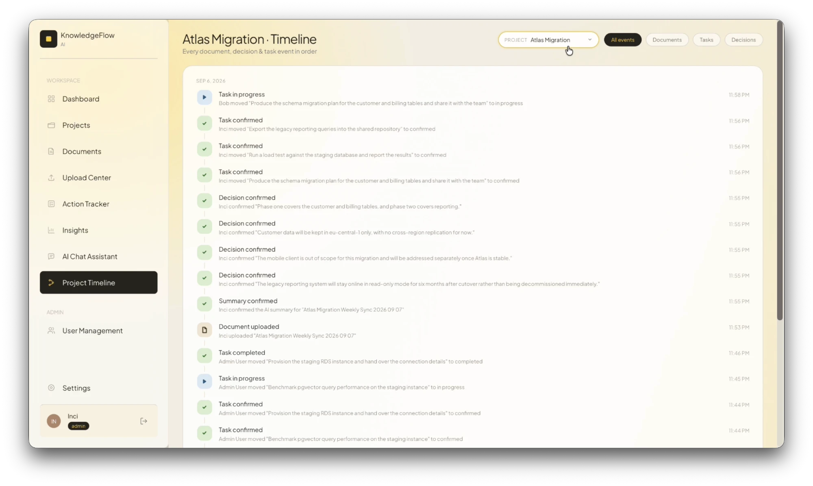 |
| Shareable report link<br/>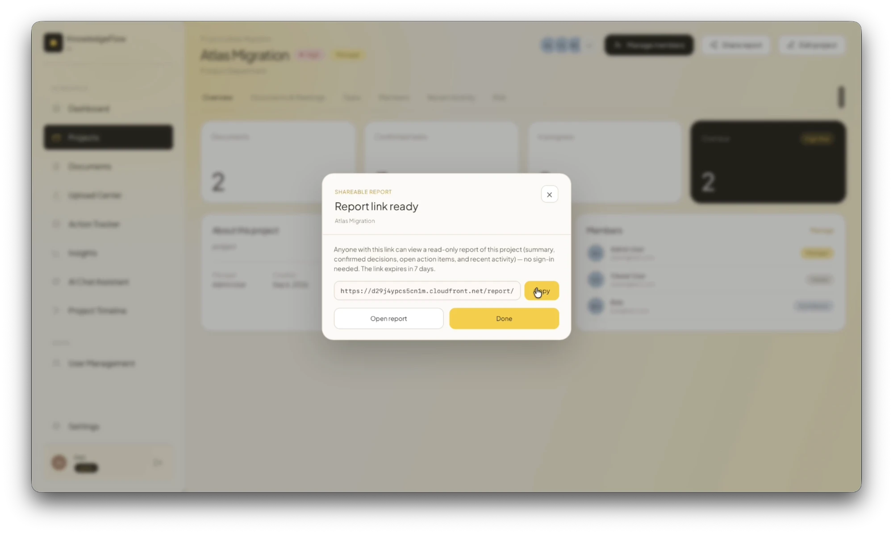 | Public project report<br/>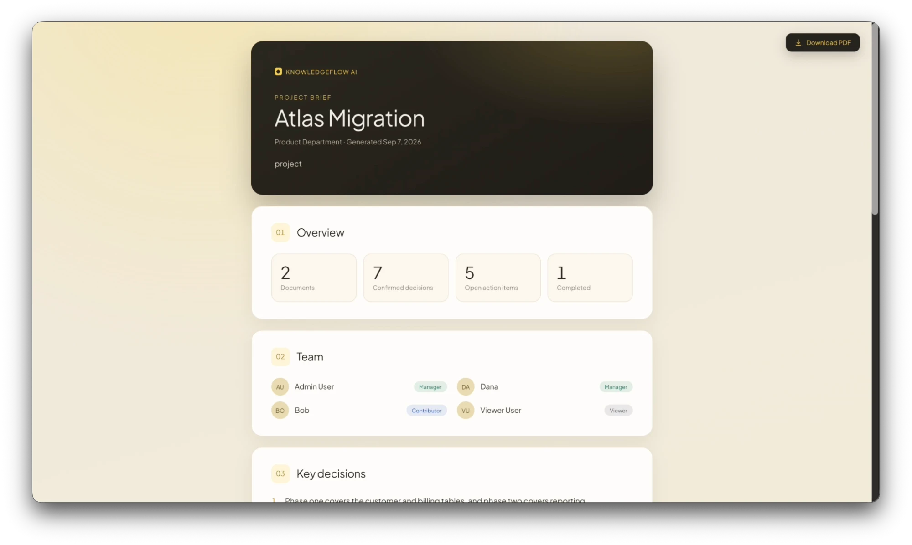 |

</details>

## Why

Organisational knowledge is produced in meetings and documents and then scattered: decisions get re-litigated, action items are forgotten, and new joiners cannot reconstruct why anything was decided. KnowledgeFlow AI connects **documents → decisions → tasks → answers** in one permissioned system.

## Features

- **AI extraction with human-in-the-loop review** — every uploaded document gets a summary, decisions and action items, each with a source excerpt and a confidence level. AI output stays a `draft` until a project manager or admin confirms it; drafts never count toward workload, overdue or risk figures.
- **Task tracking** — confirmed action items become tasks with owners, deadlines, a status lifecycle, notes and a full audit trail.
- **Project-scoped AI chat (RAG)** — documents are chunked and embedded into pgvector; questions are answered using hybrid semantic + keyword retrieval, with citations back to the source documents and an explicit "I could not find this" guardrail instead of guessing.
- **Two-level role-based access control** — a system role (admin / member) plus a per-project role (manager / contributor / viewer), enforced server-side on every route.
- **Dashboard, timeline and analytics** — role-scoped overview, project timeline, workload and project-risk scoring.
- **Notifications** — in-app notification bell plus a scheduled daily email digest of overdue and upcoming tasks.
- **Shareable project reports** — public, expiring, read-only report links with server-side PDF export.
- **Invite-only accounts** — admins create users; invitees set their own password through a hashed, one-time email link. No password is ever transmitted or stored in plain text.

Supported uploads: `pdf`, `docx`, `pptx`, `xlsx`, `odt`, `odp`, `ods`, and plain-text formats (`txt`, `md`, `csv`, `vtt`, `srt`, …).

## Architecture

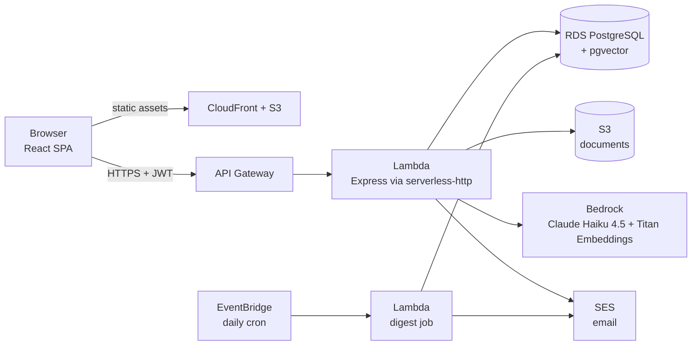

The core pipeline is **upload → text extraction → LLM extraction → human review → tracked work**, with retrieval-augmented chat over the same corpus. The Express app has two entry points over the same routers: `backend/src/index.ts` (local dev server) and `backend/src/lambda.ts` (Lambda handler).

## Tech stack

| Layer | Technologies |
|---|---|
| Frontend | React 19, TypeScript, Vite, React Router 7, Axios, hand-written CSS with light/dark theming |
| Backend | Node.js 20, Express 5, TypeScript, `pg` (raw SQL, no ORM), JWT + bcrypt, `multer`, `officeparser`, `pdfkit` |
| Database | PostgreSQL on Amazon RDS, pgvector (1024-dim embeddings, HNSW index) |
| AI | Amazon Bedrock — Claude Haiku 4.5 (extraction, chat), Titan Text Embeddings V2 |
| Infrastructure | AWS Lambda, API Gateway, S3, CloudFront, SES, EventBridge, VPC, Serverless Framework |

**By the numbers:** 12 API routers and 58 endpoints, a 15-table schema, 17 frontend screens, roughly 16,000 lines of TypeScript.

## Repository structure

```
backend/          Express + TypeScript API (also the Lambda package)
  src/routes/       route definitions, one file per resource
  src/handlers/     request handlers and business logic
  src/middleware/   JWT verification and role checks
  src/utils/        embeddings, text extraction, email, risk scoring, auth tokens
  src/jobs/         scheduled daily digest
  schema.sql        full PostgreSQL schema (15 tables + pgvector)
  serverless.yml    Lambda / API Gateway / IAM / schedule definition
frontend/         React + Vite single-page app
  src/pages/        one component per screen
  src/components/   shared UI components
  src/api/          Axios client (JWT injection, 401 handling)
docs/             technical report and technical reference
sample-files/     example meeting transcripts to upload
```

## Running locally

Prerequisites: Node.js 20+, PostgreSQL with the [pgvector](https://github.com/pgvector/pgvector) extension, and an AWS account with access to S3 and Bedrock (needed for upload, AI extraction and chat; the rest of the app works without them).

```bash
# 1. Database
createdb knowledgeflow_ai
psql -d knowledgeflow_ai -f backend/schema.sql

# 2. Backend  →  http://localhost:3001
cd backend
cp .env.example .env        # fill in DB, JWT and AWS settings
npm install
npx ts-node setup-test.ts   # optional: seeds test users and a sample project
npm run dev

# 3. Frontend  →  http://localhost:5173
cd ../frontend
cp .env.example .env
npm install
npm run dev
```

With `EMAIL_ENABLED=false` (the default), invite and password-reset links are returned in the API response instead of being emailed. Try uploading the transcripts in [`sample-files/`](sample-files/) to see the extraction pipeline.

Deployment to AWS is defined in [`backend/serverless.yml`](backend/serverless.yml) (`npm run build && npx serverless deploy --stage prod`); the VPC security-group and subnet IDs are read from environment variables listed in `backend/.env.example`.

## Documentation

- [**Technical Report**](docs/TECHNICAL_REPORT.md) — the full write-up: requirements, architecture, data model, API design, auth flows, engineering decisions, challenges, security considerations and limitations.
- [**Technical Reference**](docs/TECHNICAL_REFERENCE.md) — concise reference to routes, schema, RBAC rules and deployment configuration.

## Known limitations

This is an MVP built in a fixed internship window. AI processing runs synchronously inside the request, so very large documents can hit the 30-second Lambda limit; scanned PDFs without a text layer are not supported (no OCR); and chat answers each question independently, without conversational memory. The technical report covers these and the planned improvements in detail.

## Author

**İnci Lal Dikmen** — [github.com/laldikmen](https://github.com/laldikmen)
