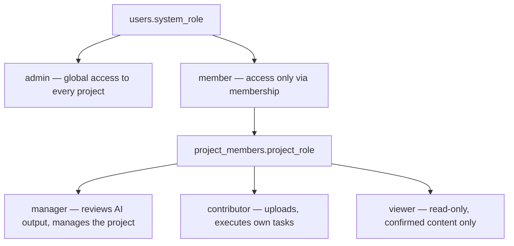
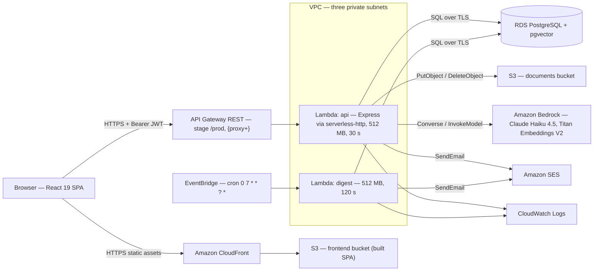
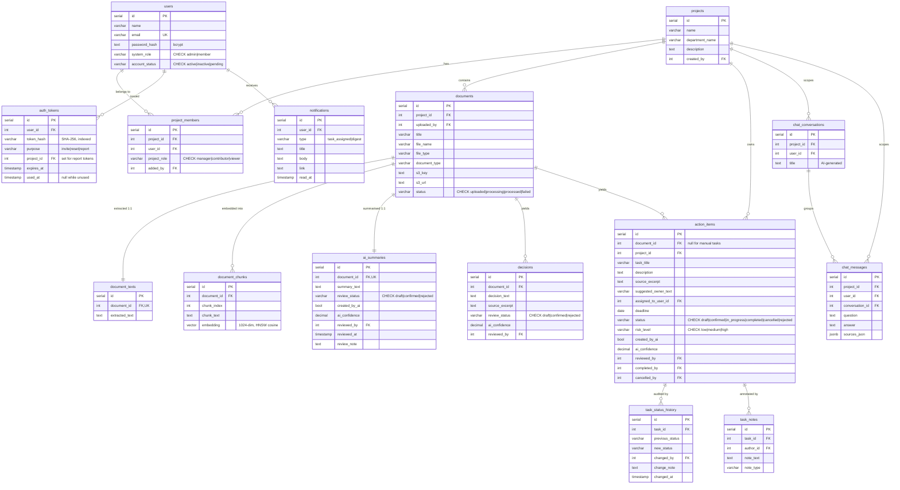
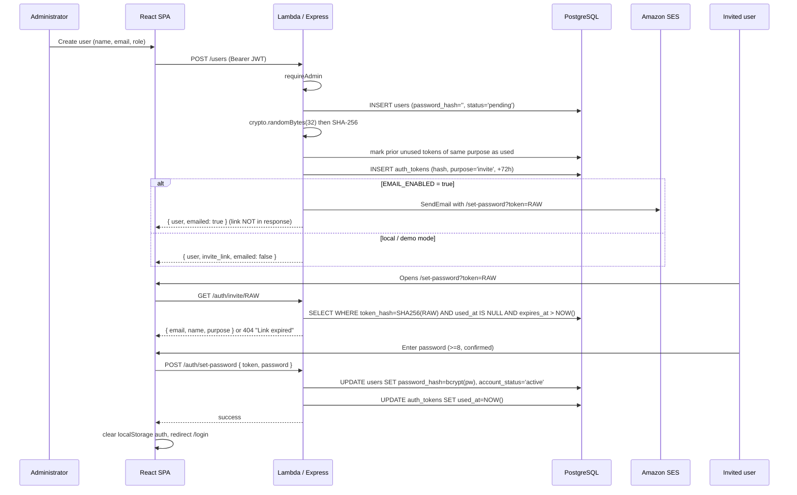
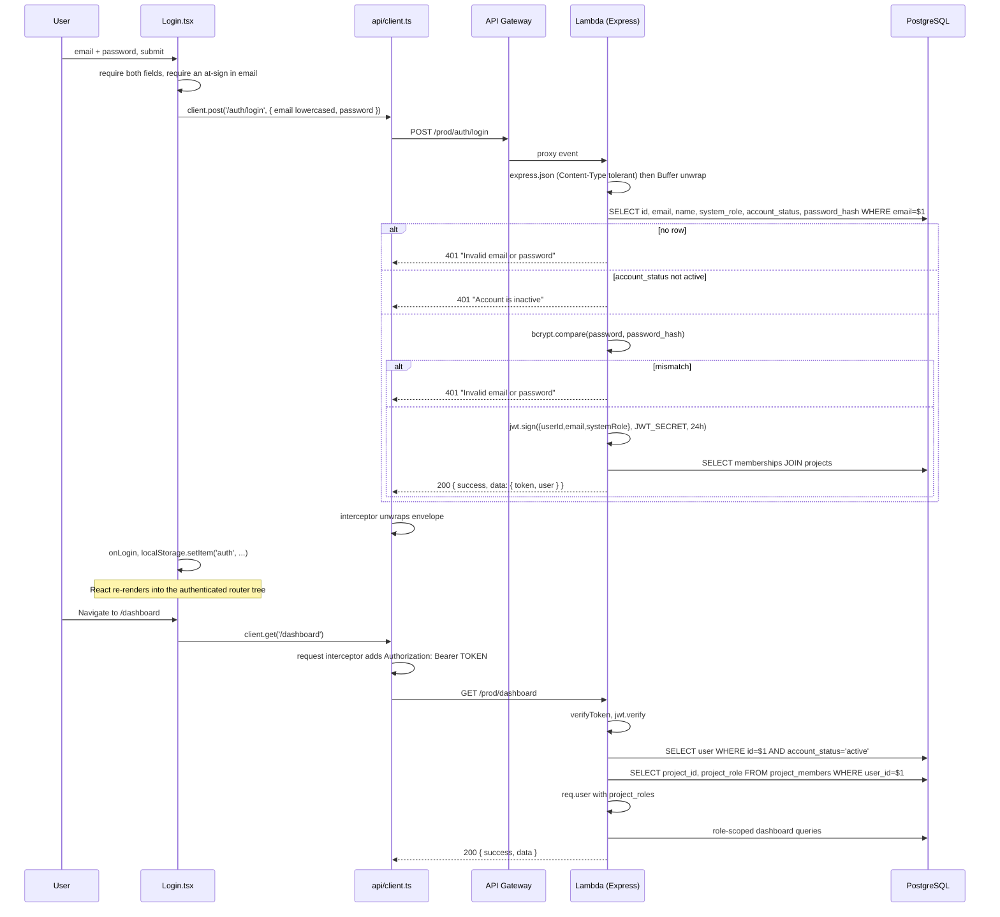
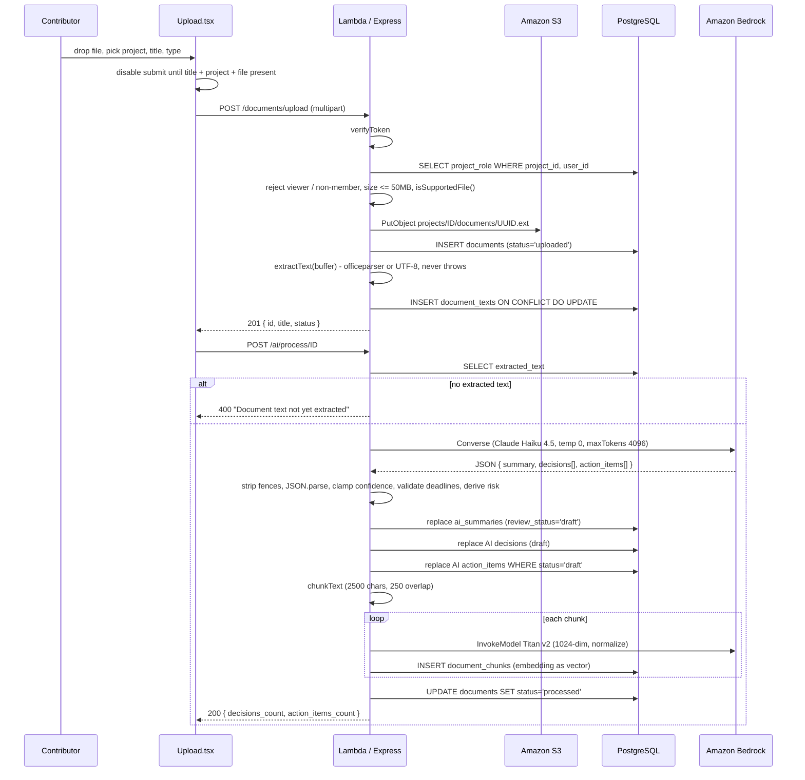
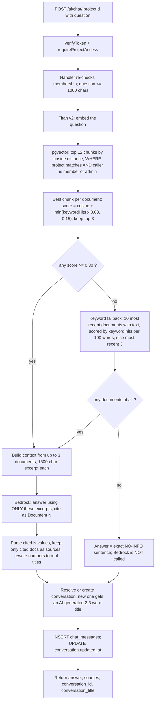

# KnowledgeFlow AI — Technical Project Report

**AI-Powered Enterprise Knowledge Hub**

Prepared for mentor review · 6 September 2026

---

## About this document

> **Snapshot note.** This report describes the repository as of 6 September 2026. A few files it
> cites (`backend-python-old/`, `DEPLOYMENT.md`, `BACKEND_SETUP_LOG.md`, the old root `README.md`)
> were removed in a later cleanup, `project_technical_reference.md` now lives at
> [`docs/TECHNICAL_REFERENCE.md`](TECHNICAL_REFERENCE.md), and the AWS deployment has been decommissioned.

This report documents **the system as it actually exists in the repository and in its deployment configuration**, not as it was originally planned. Every functional claim below was traced through the source: routes → handlers → SQL → schema, and frontend page → API client → endpoint.

The planning-stage *Project Description* PDF was used only to establish original intent, terminology and scope. Where the two disagree, the code wins; where the PDF describes something that does not exist, it is either omitted from the implemented-features sections or explicitly labelled as an original plan (see §19 and Appendix A).

**Verification boundaries — stated up front:**

| Area | Basis | Confidence |
|---|---|---|
| Application behaviour, RBAC, data model, APIs | Direct source reading of `backend/src/**`, `frontend/src/**`, `backend/schema.sql` | High — verified |
| Deployment topology and Lambda configuration | `backend/serverless.yml`, and `backend/.serverless/serverless-state.json` + generated CloudFormation template — artifacts written by the **actual deploy of 6 Sep 2026, 08:48** | High — verified from deploy artifacts |
| Live AWS account state (RDS instance class, bucket contents, CloudFront distribution settings) | Recorded in the repository's own `project_technical_reference.md` from an earlier live inspection | **Not independently verified in this pass** — see note below |
| Runtime correctness of the deployed site | — | **Not verified** |

> **Note on AWS access.** Live read-only inspection of the AWS account was attempted and was **not possible**: the execution environment's egress proxy blocks `sts`, `lambda`, `execute-api` and the CloudFront distribution domain, and no AWS CLI credentials path was reachable. No AWS API call was made, and consequently no AWS resource was created, modified or deleted. Statements about live account state are attributed to the repository's technical reference and flagged as such.

**No secret values appear in this document.** Environment variable *names* are discussed; credentials, tokens, keys, passwords, database endpoints, account identifiers and network resource identifiers are deliberately excluded.

---

## 1. Executive Summary

**What it is.** KnowledgeFlow AI is a full-stack, project-scoped enterprise knowledge platform. Teams upload documents and meeting transcripts into a project; the system extracts the text, asks a large language model for a summary, the **decisions** that were settled and the **action items** that were created, and stores all of it as *draft* output that a human must review before it counts. Confirmed action items become tracked tasks with owners, deadlines, a lifecycle and an audit trail. In parallel, every document is chunked and embedded so a project-scoped AI chat can answer questions with citations back to the source documents.

**The problem it addresses.** Organisational knowledge is generated in meetings and documents and then scattered — decisions get re-litigated, action items are forgotten, and new joiners cannot reconstruct why anything was decided. Existing tools solve one slice (transcription, or summarisation, or task tracking) without connecting documents → decisions → tasks → answers in one permissioned system.

**The core solution.** A single pipeline: *upload → extract text → LLM extraction → human review → tracked work*, with a retrieval-augmented chat over the same corpus and a risk/analytics layer over the resulting task data. The defining design commitment is **human-in-the-loop**: AI output is a suggestion (`draft`) until a Project Manager or System Administrator confirms it, and draft items are excluded from workload, overdue and project-risk calculations.

**Main technologies.** React 19 + Vite + TypeScript SPA on CloudFront/S3; a TypeScript Express application running as an AWS Lambda behind API Gateway via `serverless-http`; PostgreSQL on Amazon RDS with the **pgvector** extension carrying both relational data and the semantic index; Amazon Bedrock for both generation (Claude Haiku 4.5) and embeddings (Titan Text Embeddings V2); Amazon S3 for original files; Amazon SES for transactional mail; EventBridge for a daily scheduled job.

**Most important capabilities.** Two-level RBAC (system role + per-project role) enforced server-side on every route; AI extraction of summaries, decisions and action items with per-item source excerpts and confidence; a full task lifecycle with status history and notes; hybrid semantic + keyword retrieval with an explicit "I could not find this" guardrail; a role-scoped dashboard and analytics view; in-app notifications plus a scheduled email digest; and public, expiring, shareable read-only project report links with PDF export.

**Result.** 35 backend TypeScript modules (~6,550 LOC) exposing 12 routers and 58 endpoints, a 17-screen frontend (~9,550 LOC), a 15-table PostgreSQL schema, and a working serverless deployment in `eu-central-1` comprising two Lambda functions, a REST API, an S3 + CloudFront frontend and a scheduled digest job.

---

## 2. Project Background and Motivation

### 2.1 The original problem

The planning document frames the problem as knowledge dispersal: organisations produce large volumes of information daily through meetings, reports, presentations and project documentation, spread across multiple platforms. The stated consequences were that knowledge is easily lost, employees spend significant time searching, decisions are repeated across meetings, action items and deadlines are forgotten, and onboarding is slow.

### 2.2 Why the project was created

The planning document positions KnowledgeFlow AI against a market gap: several tools offer meeting transcription, document summarisation or note-taking, but most address a single function and **do not connect meetings, documents, decisions and tasks into one knowledge system**. The intended differentiator was a unified, permissioned knowledge hub where all of that becomes interconnected, searchable and reachable through an assistant.

That framing survived into the implementation essentially intact, and it is visible in the data model: `documents` → `document_texts` → (`ai_summaries`, `decisions`, `action_items`) → `task_status_history` / `task_notes`, with `chat_messages.sources_json` pointing back at the documents an answer came from. The join between "what was said", "what was decided" and "what is being done" is a foreign key, not a convention.

### 2.3 Intended users

The system is built for employees inside a single organisation, differentiated by responsibility rather than by department:

- **System Administrators** — platform operators who provision accounts and projects.
- **Project / Department Managers** — accountable for a project's knowledge quality; they are the review gate for AI output.
- **Contributors** — people doing the work; they upload material and execute tasks assigned to them.
- **Viewers** — stakeholders who need visibility without the ability to change anything.

There is **no public self-registration**; this was an explicit planning decision and it is implemented (§12.2).

### 2.4 Original goals (from the planning document)

The planned MVP covered: user login and account management; system- and project-level roles; project/department creation and membership; document and transcript upload; S3 file storage with metadata; AI summaries, decisions and action items with suggested owners and deadlines; human review of AI output; task lifecycle management; an Action Tracker; role-filtered dashboards; an AI chat assistant restricted to accessible documents; source-document references; task status and review history; and predictive task/project risk analysis.

Nearly all of this exists. What changed most is **how** it was built rather than **what** was built — the compute and AI shape is the same, but the runtime backend language, the retrieval strategy, the trigger mechanism for AI processing and the endpoint naming all diverged. §19 covers the evolution.

---

## 3. Project Objectives and Requirements

### 3.1 Functional objectives

| # | Objective | Status | Evidence |
|---|---|---|---|
| F1 | Authenticate users and restrict everything to authenticated sessions | Implemented | `middleware/auth.ts::verifyToken`; every router except `auth` and `reports` calls `router.use(verifyToken)` |
| F2 | Two-level role model (system + project) | Implemented | `users.system_role`, `project_members.project_role`; enforced in middleware and in each handler |
| F3 | Admin-managed provisioning of users and projects | Implemented | `handlers/users.ts`, `handlers/projects.ts::createProject` |
| F4 | Upload documents and transcripts, store originals durably | Implemented | `handlers/documents.ts::uploadDocument` → S3 `projects/{id}/documents/{uuid}.{ext}` |
| F5 | Extract machine-readable text from uploads | Implemented | `utils/textExtraction.ts` (officeparser + UTF-8 decode) |
| F6 | AI summary, decisions, action items with owners, deadlines, sources, confidence | Implemented | `handlers/ai.ts::processDocument` |
| F7 | Human review gate on all AI output | Implemented | `review_status` / `status = 'draft'` defaults; `reviewSummary`, `reviewDecision`, `reviewActionItem` |
| F8 | Full task lifecycle with history | Implemented | `action_items.status`, `task_status_history`, `task_notes` |
| F9 | Action Tracker board | Implemented | `pages/ActionTracker.tsx` (board + table views, five status columns) |
| F10 | Role-filtered dashboard | Implemented | `handlers/dashboard.ts` — admin / manager / assignee scoping |
| F11 | Project & task risk analysis | Implemented, **redefined** | `utils/risk.ts` — weighted leading-indicator score, not the PDF's overdue-count buckets |
| F12 | Document-grounded AI chat with citations and refusal behaviour | Implemented, **expanded** | `handlers/chat.ts` — hybrid vector + keyword retrieval, exact NO-INFO sentence |
| F13 | Project activity timeline | Implemented | `handlers/timeline.ts` |
| F14 | Notifications | **Added after planning** | `handlers/notifications.ts`, `jobs/digest.ts` |
| F15 | Analytics / Insights | **Added after planning** | `handlers/analytics.ts`, `pages/Insights.tsx` |
| F16 | Shareable read-only project report + PDF | **Added after planning** | `handlers/reports.ts`, `pages/PublicReport.tsx` |
| F17 | Invite / password-reset by email | **Added after planning** | `utils/authTokens.ts`, `utils/email.ts` |

### 3.2 Technical objectives

| # | Objective | Status | Notes |
|---|---|---|---|
| T1 | Serverless, pay-per-use compute | Implemented | Two Lambda functions; no always-on servers |
| T2 | Access control enforced on the **server**, not just hidden in the UI | Implemented | Verified per handler; the UI additionally hides controls |
| T3 | Type safety across the stack | Implemented | TypeScript on both sides; shared vocabulary in `backend/src/types/index.ts` |
| T4 | Same codebase runs locally and in Lambda | Implemented, with a caveat | `index.ts` (local) and `lambda.ts` (Lambda) mount the same routers but are **separate files** — a known duplication risk (§14.2) |
| T5 | Semantic search without a separate always-on vector service | Implemented | pgvector inside the existing RDS instance |
| T6 | Correct date/time semantics across zones | Implemented | Custom `pg` type parsers for OID 1082/1114 (§15.3) |

### 3.3 Constraints visible in the implementation

- **Lambda package size.** `serverless.yml` excludes `typescript`, `serverless`, and all `*.d.ts` / `*.map` / `*.md` files from `node_modules` specifically to stay under Lambda's 250 MiB unzipped limit; the shipped artifact is ~61.5 MB zipped.
- **Lambda request timeout.** The API function is capped at 30 s, which bounds synchronous AI processing of a single document.
- **VPC placement.** Because the Lambda must reach RDS privately it runs inside the VPC, which in turn requires explicit egress paths to S3, Bedrock and SES.
- **SES sandbox.** Email delivery is limited to verified recipients (§20).
- **Upload size.** Multer is configured with a 50 MB limit, re-checked in the handler.

---

## 4. Final Implemented Feature Set

### 4.1 Identity and account management

**What it does.** Administrators create accounts; invited people set their own password through a one-time link, which activates the account. There is no signup page.

**Who uses it.** System Administrators only, for creation/edit/deactivate/delete; any user for password reset.

**How the user interacts.** `/users` (User Management) is admin-only in the router (`App.tsx` redirects non-admins) and the sidebar section is hidden for non-admins. Creating a user opens a form for name, email, system role and an initial set of project memberships.

**Business rules.**

- A new account is inserted with `account_status = 'pending'` and an **empty** `password_hash` — it cannot be logged into until the invite is consumed.
- Invite links are valid **72 hours**; reset links **1 hour**.
- Creating a second unused token of the same purpose invalidates the earlier one (`UPDATE auth_tokens SET used_at = NOW() … WHERE used_at IS NULL`).
- Email uniqueness is enforced both by a DB `UNIQUE` constraint and by an explicit pre-check returning `409`.
- An administrator cannot delete their own account.
- Deletion is possible but deactivation is the documented preference; foreign keys are `ON DELETE SET NULL` for authorship columns so history survives a deleted user.

**Implementation.** `routes/users.ts` (all mutating routes behind `requireAdmin`), `handlers/users.ts`, `utils/authTokens.ts`, `utils/email.ts`, `pages/UserManagement.tsx`, `pages/SetPassword.tsx`.

### 4.2 Projects and membership

**What it does.** A project (optionally tagged with a department name) is the unit of access control. Every document, task, chat conversation and report belongs to exactly one project.

**Business rules.**

- Only System Administrators may create, edit or delete a project (`createProject`, `updateProject`, `deleteProject` all check `system_role === 'admin'`).
- The creating administrator is automatically inserted as the project's `manager`.
- Membership uses `ON CONFLICT (project_id, user_id) DO UPDATE`, so adding an existing member is a role change.
- **Only a System Administrator may add, remove or change a Project Manager.** A non-admin manager attempting either receives `403` — implemented as an explicit pre-check in both `addProjectMember` and `removeProjectMember`, closing the upsert path that would otherwise let one manager demote another.
- Deleting a project makes a best-effort pass to delete its S3 objects first, then deletes the row; members, documents, tasks and chat cascade away via `ON DELETE CASCADE`.

**Implementation.** `routes/projects.ts`, `handlers/projects.ts`, `pages/Projects.tsx`, `pages/ProjectDetail.tsx`.

### 4.3 Document management

**What it does.** Upload a file into a project, store the original in S3, record metadata in PostgreSQL, and extract its text immediately so it is ready for AI processing.

**Business rules.**

- Viewers cannot upload (explicit `403`). Non-members cannot upload unless they are a System Administrator.
- Unsupported file types are rejected **before** the S3 write, so no document can exist with no analysable content. Accepted: `pdf, docx, pptx, xlsx, odt, odp, ods` (parsed with `officeparser`) and `txt, md, csv, log, json, vtt, srt` (UTF-8 decode), plus any `text/*` MIME type.
- Files are limited to 50 MB.
- S3 keys are `projects/{projectId}/documents/{uuid}.{ext}` — a random UUID, so the original filename never becomes part of a guessable key.
- Text extraction is wrapped in `try/catch` and **never fails the upload**; a parse failure leaves the document uploaded but unanalysed.
- Editing and deleting a document require System Administrator or the **project's manager**. Moving a document to another project additionally requires manager rights in the destination project (admins excepted).

**Implementation.** `routes/documents.ts` (multer, memory storage), `handlers/documents.ts`, `utils/textExtraction.ts`, `pages/Upload.tsx`, `pages/Documents.tsx`, `pages/DocumentDetail.tsx`.

### 4.4 AI extraction (summary, decisions, action items)

**What it does.** A single Bedrock call per document returns a strict JSON object containing a summary, a list of decisions and a list of action items, each carrying the verbatim source sentence it was drawn from and a self-reported confidence.

**Who uses it.** Triggered automatically by the Upload page immediately after a successful upload; also callable directly. Permitted for System Administrators, project managers and contributors — **not** viewers.

**Business rules.**

- The prompt forces a **mutually exclusive classification**: a decision is a settled conclusion with no owner or deadline; an action item is work to be done. An item may never appear in both lists.
- Every stored row starts as `draft`.
- Re-processing is **idempotent**: the previous summary is deleted, AI-generated decisions are deleted, and AI-generated action items are deleted **only where `status = 'draft'`** — anything a human already reviewed survives a re-run.
- Confidence values are clamped to `[0, 1]` with a 0.7 fallback; deadlines are regex-validated to `YYYY-MM-DD` or nulled.
- **Risk level is computed from the deadline, not taken from the model** — ≤3 days out = `high`, ≤7 days = `medium`, otherwise `low`. The model is asked for a risk estimate, but the deterministic rule wins. A manager can override afterwards.
- Embedding generation runs after extraction and is best-effort: a failure is logged and the document still completes as `processed` (chat then falls back to keyword retrieval for it).

**Review rules.**

- Only System Administrators and project managers may confirm/reject or edit AI content.
- Editing a **summary** resets it to `draft` and clears the reviewer — a changed summary must be re-confirmed.
- Editing a **decision** deliberately *keeps* its review status, so an already-confirmed decision stays on the Project Timeline with corrected text instead of silently dropping off it. This asymmetry is intentional and commented in the source.
- Confirming an action item that is already assigned to someone else fires a `task_assigned` notification.
- Viewers see **only confirmed** summaries, decisions and action items — enforced in `getDocumentDetail`, `getAISummary` and `getAIDecisions`, not merely in the UI.

**Implementation.** `handlers/ai.ts`, `utils/embeddings.ts`, `pages/DocumentDetail.tsx`.

### 4.5 Task and action tracking

**What it does.** Confirmed action items — plus manually created tasks — are tracked through Draft → Confirmed → In Progress → Completed, with Cancelled and Rejected as terminal branches.

**Business rules.**

- Manual tasks are created directly as `confirmed` with `created_by_ai = false` (admins and project managers only).
- **Contributors** may only touch tasks assigned to them, may only move them to `in_progress` or `completed`, and are explicitly blocked from changing owner, deadline, risk level, title, description, source excerpt or project — each rejected field is named back in the error message.
- Task assignment validates that the target user is a **member of that project**.
- Completing records `completed_by`, `completed_at` and an optional note; cancelling records `cancelled_by`, `cancelled_at` and a reason.
- Every status change writes a `task_status_history` row carrying the relevant note (completion note, cancel reason, or an explicit `change_note`).
- Progress notes are stored separately in `task_notes` and may be added by the assignee, the project manager or an administrator.
- Overdue is **computed, never stored**: `deadline < CURRENT_DATE AND status IN ('confirmed','in_progress')`.
- Draft tasks are hidden from viewers: non-admins see drafts only in projects where they are a manager or contributor.

**Implementation.** `routes/tasks.ts`, `handlers/tasks.ts`, `pages/ActionTracker.tsx`, `pages/TaskDetail.tsx`, `components/CreateTaskModal.tsx`, `components/TaskEditModal.tsx`.

### 4.6 AI chat assistant

**What it does.** Project-scoped question answering grounded in that project's documents, with inline citations by document name and a persistent, titled conversation history.

**Business rules.**

- Scope is one project per conversation; `requireProjectAccess` runs before the handler, which re-checks membership.
- Questions are capped at 1,000 characters.
- If retrieval returns nothing, the model is **not called at all** — the response is the exact sentence *"I could not find this information in the documents available to your account."* This removes the possibility of a fabricated answer in the no-grounding case.
- The prompt instructs the model to answer only from the supplied excerpts and to cite `[Document N]`.
- Citations are post-processed: the handler parses which `Document N` references the model actually used, keeps only those as sources, and rewrites the numeric references into real document titles so the inline citations and the Sources list agree.
- A new conversation gets a 2–3 word AI-generated title (with a deterministic fallback derived from the first question).
- Conversations are per user; `GET /ai/chat/:projectId/history` returns all users' messages only to project managers and admins.

**Retrieval mechanics.** Detailed in §13.3.

**Implementation.** `handlers/chat.ts`, `utils/embeddings.ts`, `pages/AIChat.tsx`.

### 4.7 Dashboard, timeline and analytics

**Dashboard** (`GET /dashboard`) returns recent uploads, draft tasks awaiting review, confirmed / in-progress / completed task lists, overdue tasks, deadlines in the next 7 days, per-project risk, and a summary block. Scoping is role-aware and asymmetric by design:

- Documents/uploads are scoped to **all accessible projects** for everyone, because document visibility is a project-membership property.
- Task lists are scoped to *everything in managed projects* for admins and managers, but to *items assigned to me* for contributors and viewers.
- The header subtitle is data-driven: reviewers see "N items need your review", everyone else sees "N tasks waiting for you".

**Project Timeline** (`GET /timeline/:projectId`) merges four event sources in time order: document uploads, **confirmed** decisions, **confirmed** summaries, and task status changes — a single `UNION ALL` query.

**Insights** (`GET /analytics`) is one payload driving the whole page: headline counts, a gap-filled 6-month created-vs-completed series, status and risk distributions, a per-owner throughput leaderboard, the most "productive" documents by extracted-item count, and a per-project rollup. Access is tiered:

| Access level | Who | What they get |
|---|---|---|
| `full` | System Administrators, and anyone who manages any project | Everything, including the per-person leaderboard |
| `limited` | Contributors who manage nothing | Everything except the leaderboard; their own throughput only |
| `none` | Viewer-only members and non-members | `403`; the sidebar item is hidden |

### 4.8 Notifications and daily digest

- `createNotification()` writes an in-app row; every call site wraps it so a notification failure never breaks the primary operation.
- Triggers: task creation with an assignee, task owner change, and confirmation of an assigned AI action item — each skipped when the actor is assigning to themselves.
- The bell (`NotificationBell.tsx`) polls `GET /notifications` every 60 s, shows an unread badge, supports mark-all-read and marks-on-click.
- A **scheduled Lambda** runs `cron(0 7 * * ? *)` (07:00 UTC daily): for every user with overdue or next-7-day tasks it writes one digest notification and sends an SES digest email.
- Housekeeping on each run: digest notifications older than 7 days are deleted, and the previous *unread* digest for a user is replaced rather than stacked.

### 4.9 Shareable project reports

- An administrator or project manager calls `POST /projects/:projectId/report-link`, which mints a random 32-byte `report` token (stored SHA-256-hashed) with a **7-day** expiry and returns a public URL.
- `GET /reports/:token` and `GET /reports/:token/pdf` are the **only two authenticated-user-free application endpoints**; the unguessable, expiring token is the entire access control.
- The report contains overview stats, team and roles, confirmed decisions, open action items with owner/deadline/risk, and recent activity.
- The PDF is generated server-side with `pdfkit`. Because API Gateway must be told to treat the payload as binary, `binaryMediaTypes: ['application/pdf']` is set and the Lambda handler is wrapped as `serverless(app, { binary: ['application/pdf'] })`; the frontend fetches with an explicit `Accept: application/pdf` header and saves the resulting blob.

---

## 5. User Roles and User Journeys

### 5.1 The two-level model

Access is the product of two independent dimensions:



A user may be a manager in one project, a contributor in another and a viewer in a third; `verifyToken` loads the full membership list onto `req.user.project_roles` on every request.

### 5.2 Permission matrix — as implemented

| Capability | System Admin | Project Manager | Contributor | Viewer |
|---|---|---|---|---|
| See projects | All | Assigned | Assigned | Assigned |
| Create / edit / delete project | Yes | No | No | No |
| Manage user accounts | Yes | No | No | No |
| Add or remove a Project Manager | Yes | No | No | No |
| Add / remove contributors and viewers | Yes | Assigned projects | No | No |
| Upload documents | Yes | Yes | Yes | No |
| Edit / delete / move a document | Yes | Assigned projects | No | No |
| Trigger AI processing | Yes | Yes | Yes | No |
| See **draft** AI output | Yes | Yes | Yes (assigned projects) | No |
| Confirm / reject / edit AI output | Yes | Yes | No | No |
| Create a task | Yes | Yes | No | No |
| Assign / reassign a task | Yes | Yes | No | No |
| Change task title, deadline, risk, project | Yes | Yes | No | No |
| Move own task to In Progress / Completed | Yes | Yes | Own tasks | No |
| Cancel a task | Yes | Yes | No | No |
| Delete a task | Yes | Yes | No | No |
| Add a progress note | Yes | Yes | Own tasks | No |
| Use the AI chat | Yes | Yes | Yes | Yes |
| See other users' chat history | Yes | Assigned projects | No | No |
| Insights / analytics | Full | Full | Limited | None |
| Create a shareable report link | Yes | Assigned projects | No | No |
| List users (`GET /users`) | Yes | Yes | Yes | Yes |

The last row is a deliberate implementation trade-off, and it diverges from the planning document — see §17.4.

### 5.3 Representative journeys

**A. Administrator onboards a team (first-run flow).**
Log in → *User Management* → create user (account is created `pending`, invite link generated and emailed) → *Projects* → create project (creator auto-added as manager) → open the project → add members with roles → the invited user opens their link, sets a password (≥8 characters, confirmed), the account flips to `active`, and any stale local session is cleared so they land on a fresh login.

**B. Contributor turns a meeting into tracked work.**
*Upload Center* → the project dropdown is filtered to projects where they can upload → drag in a transcript, set title/type/description → `POST /documents/upload` stores the file in S3, writes the `documents` row and extracts text → the page immediately calls `POST /ai/process/:documentId` → the *Document Detail* page shows the draft summary, decisions and action items, each with the verbatim source sentence and a confidence value.

**C. Manager reviews and delegates.**
Dashboard header reads "N items need your review" → open the document → confirm the summary, confirm two decisions and reject one (with a note) → edit a draft action item's title and deadline, assign an owner from the project's members, confirm it → the task moves to Confirmed on the Action Tracker, a `task_status_history` row is written, and the assignee receives a `task_assigned` notification.

**D. Assignee executes.**
Notification bell → task detail → *Start* (→ In Progress, history row) → add a progress note → *Complete* with a completion note (records `completed_by`, `completed_at`, note carried into history). Attempting to change the deadline returns `403 Contributors cannot change the deadline of a task`.

**E. Viewer asks a question.**
*AI Chat* → pick an accessible project → ask → retrieval runs over that project's chunks only → the answer cites documents by name, with an expandable Sources list. Draft AI content is invisible to them throughout.

**F. Manager shares outside the platform.**
Project Detail → *Share report* → a 7-day public link is minted → an external stakeholder opens it with no account and can download the PDF.

---

## 6. Technology Stack

Only technologies present in the current implementation are listed.

### Frontend

| Technology | Where | Purpose | Why it fits |
|---|---|---|---|
| React 19 | `frontend/src/**` | UI component model | Mature ecosystem; the app is a stateful dashboard, not a content site |
| TypeScript ~6.0 | all frontend source | Static typing | Same type vocabulary as the backend; catches API-shape drift at compile time |
| Vite 8 | build / dev | Bundling, dev server, env injection | Fast HMR; produces a static bundle that drops straight onto S3/CloudFront |
| React Router 7 | `App.tsx` | Client-side routing | The SPA needs deep links (`/report/:token`, `/set-password`) that survive reload |
| Axios | `api/client.ts` | HTTP client | Interceptors give one place for JWT injection, envelope unwrapping and 401 handling |
| `@fontsource/plus-jakarta-sans` | `main.tsx` | Self-hosted webfont | Avoids a third-party font CDN request |
| oxlint | `npm run lint` | Linting | Fast Rust-based linter; low config overhead |
| Hand-written CSS | one `.css` per page/component | Styling and theming | No framework; a CSS-variable token set drives light/dark theming |

### Backend

| Technology | Where | Purpose | Why it fits |
|---|---|---|---|
| Node.js 20 | Lambda runtime | Execution | Current supported Lambda runtime |
| Express 5 | `index.ts` / `lambda.ts` | HTTP framework, routing, middleware | Familiar router/middleware model; runs identically locally and in Lambda |
| TypeScript | `backend/src/**` | Static typing | Shared types with the frontend; safer refactors across ~6.5k LOC |
| `serverless-http` | `lambda.ts` | Adapts Express to the Lambda handler signature | Lets one application serve both targets without a rewrite |
| `pg` | `db/connection.ts` | PostgreSQL driver | Direct SQL, no ORM; custom type parsers are possible (§15.3) |
| `bcrypt` | `handlers/auth.ts` | Password hashing (10 rounds) | Deliberately slow, salted, industry standard |
| `jsonwebtoken` | auth handler + middleware | Stateless session tokens | No session store to run — a good fit for Lambda |
| `multer` (memory storage) | `routes/documents.ts` | Multipart upload parsing | Buffer goes straight to S3; nothing touches Lambda's ephemeral disk |
| `officeparser` | `utils/textExtraction.ts` | Text extraction from PDF/Office formats | One dependency covering every binary format accepted |
| `pdfkit` | `handlers/reports.ts` | Server-side PDF generation | Programmatic layout; no headless browser in the Lambda package |
| `aws-sdk` v2 | S3, Bedrock, SES, Secrets Manager clients | AWS integration | Chosen at build time; v3 migration is outstanding (§20) |
| `crypto` (Node built-in) | `utils/authTokens.ts` | Token generation and SHA-256 hashing | No dependency needed for 32-byte random tokens |

### Database

| Technology | Where | Purpose | Why it fits |
|---|---|---|---|
| PostgreSQL (Amazon RDS) | all persistence | Relational store | The domain is highly relational (memberships, review chains, history) |
| pgvector | `document_chunks.embedding vector(1024)` | Semantic index | Keeps vectors beside the rows they belong to; no second datastore to operate or pay for |
| HNSW index (`vector_cosine_ops`) | `idx_document_chunks_embedding` | Approximate nearest-neighbour search | Fast top-k cosine retrieval at this corpus size |
| JSONB | `chat_messages.sources_json` | Citation payload | Shape varies; no need for a separate citations table |

### AI services

| Technology | Where | Purpose | Why it fits |
|---|---|---|---|
| Amazon Bedrock — Claude Haiku 4.5 (cross-region inference profile, Converse API) | `handlers/ai.ts::callBedrock` | Extraction, chat answers, conversation titles | Managed, in-region, IAM-authenticated; no API key to store. `temperature: 0` for reproducible structured output |
| Amazon Titan Text Embeddings V2 (1024-dim, normalised) | `utils/embeddings.ts` | Chunk and query embeddings | Same provider and IAM path as generation; 1024 dims matches the column definition |

### Infrastructure

| Technology | Where | Purpose | Why it fits |
|---|---|---|---|
| AWS Lambda | two functions (`api`, `digest`) | Compute | Pay-per-use; a demo/MVP workload has no steady traffic to justify servers |
| Amazon API Gateway (REST, edge-optimised) | `{proxy+}` → `api` | Public HTTP entry point | Native Lambda integration, CORS, binary media types |
| Amazon S3 | documents bucket + frontend bucket | Object storage | Durable, cheap; the natural origin for both files and a static SPA |
| Amazon CloudFront | frontend distribution | CDN, TLS, SPA fallback | Serves the SPA globally and rewrites 403/404 to `/index.html` for deep links |
| Amazon SES | invite / reset / digest email | Transactional mail | Same account and IAM path; no third-party mail vendor |
| Amazon EventBridge | `cron(0 7 * * ? *)` | Scheduled digest | Serverless scheduling with no cron host |
| Amazon VPC | Lambda in three private subnets | Private RDS connectivity | Keeps database traffic off the public internet |
| AWS Secrets Manager | referenced in `db/connection.ts`, IAM-granted | Intended DB-credential source | Present but **inactive in production** — see §17.5 |
| Amazon CloudWatch Logs | log group per function | Logs | Default destination for `console.log` / `console.error` |
| Serverless Framework v3 | `backend/serverless.yml` | IaC and deployment | Declares functions, IAM, VPC, schedule and packaging in one file |

### Development tooling

| Technology | Where | Purpose |
|---|---|---|
| `ts-node` / `nodemon` | `npm run dev`, `dev:watch` | Local backend with reload |
| `serverless-offline` | `npm run deploy:local` | Local Lambda emulation |
| `tsc` | `npm run build` | Compilation to `dist/` |
| `backend/setup-test.ts`, `backend/create-test-users.js` | manual seeding | Seed users, a project and memberships for local development |

---

## 7. High-Level System Architecture

### 7.1 Components and relationships



### 7.2 How the parts relate

- **The browser talks to two different origins.** Static assets come from CloudFront; every data call goes directly to the API Gateway URL baked into the bundle at build time as `VITE_API_BASE_URL`. There is no API proxying through CloudFront, which is why the API must send permissive CORS headers (§17.6).
- **One Lambda serves the entire API.** API Gateway forwards everything under `/{proxy+}` to a single function; Express does all routing inside it. This keeps routing logic in one place at the cost of a single cold-start profile and one blast radius.
- **Both Lambdas run inside the VPC** so they can reach RDS on a private address. That placement is what makes explicit egress to S3, Bedrock and SES necessary.
- **The database is the integration point.** There is no message queue, no cache and no separate search service. Semantic retrieval, relational queries and audit history all resolve against the same PostgreSQL instance.
- **The digest function shares the code bundle** but has its own handler, memory/timeout profile and trigger.

### 7.3 What is deliberately *not* in the architecture

Named here because the planning document implied some of them, and their absence is a design decision rather than an oversight:

- No S3 event trigger for AI processing — extraction is invoked synchronously by the client (§14.3).
- No DynamoDB (§19).
- No separate vector database — pgvector inside RDS (§14.4).
- No background job queue; the only asynchronous work is the daily EventBridge digest.
- No API Gateway authorizer — authentication is Express middleware inside the Lambda.

---

## 8. Frontend Architecture

### 8.1 Structure

```
frontend/src/
  main.tsx              React root
  App.tsx               auth state, theme state, three router trees
  api/client.ts         the single Axios instance
  layouts/AppLayout.tsx authenticated shell: sidebar + header + routed content
  pages/                one component (+ CSS) per screen — 17 pages
  components/           Avatar, Button, Card, Input, Pill, StatCard, ActivityItem,
                        Header, Sidebar, NotificationBell, ConfirmationModal,
                        CreateTaskModal, TaskEditModal
  utils/date.ts         timezone-safe date-only formatting
```

### 8.2 Routing and route protection

`App.tsx` selects between **three router trees** rather than wrapping routes in guards:

1. **Public standalone.** If `window.location.pathname` is `/set-password`, `/forgot-password`, or starts with `/report/`, only those routes render — *before* the authentication check. This is deliberate: an administrator who is already signed in must be able to open an invite link they just generated without being bounced into their own session.
2. **Unauthenticated.** No stored `auth` → only `/login` plus the public pages; everything else redirects to `/login`.
3. **Authenticated.** The full application inside `AppLayout`.

Within the authenticated tree, `/users` is additionally gated: a non-administrator is redirected to `/dashboard`. This is a UX guard, not the security boundary — `routes/users.ts` enforces `requireAdmin` server-side.

### 8.3 Major pages

| Page | Responsibility |
|---|---|
| `Dashboard` | Role-scoped stat cards, review queue, overdue/upcoming lists, project risk overview |
| `Projects` / `ProjectDetail` | Project list with risk pills; per-project workspace with members, documents, tasks, activity, risk factors and mitigation suggestions, member management, report sharing |
| `Documents` / `DocumentDetail` | Document library with search and inline edit/delete; per-document AI review workspace with a source-excerpt panel |
| `Upload` | Drag-and-drop upload with project/type/title/description, then automatic AI trigger |
| `ActionTracker` / `TaskDetail` | Kanban board and table views with project/risk/assignee/overdue filters; task detail with lifecycle actions, notes and history |
| `AIChat` | Multi-conversation chat with a history sidebar, project selector, citations and Sources |
| `Insights` | Analytics dashboard, rendered according to `access_level` |
| `Timeline` | Per-project chronological activity feed |
| `UserManagement` | Admin CRUD over users and their memberships |
| `Settings` | Profile, theme preference, password-reset trigger |
| `Login` / `SetPassword` / `ForgotPassword` / `PublicReport` | Unauthenticated surfaces |

### 8.4 State management

There is **no state-management library** — no Redux, Zustand, React Query or Context provider tree. State is deliberately local:

- **Session state** lives in `App.tsx` (`useState`, seeded from `localStorage`) and is passed down as props.
- **Server data** is fetched per page in `useEffect` into local `useState`, with a `cancelled` flag in the cleanup function to avoid setting state after unmount.
- **UI preferences** — the theme (`light` / `dark` / `system`) — persist in `localStorage` and are applied by writing `data-theme` onto `document.documentElement`; when set to `system`, a `matchMedia` listener tracks OS changes.

For an application of this size (each page is essentially one screen with one or two endpoint dependencies) this avoids a large abstraction for little benefit. The cost is no shared cache: navigating between pages refetches, and the same `/projects` list is requested by several pages independently.

### 8.5 API communication

`api/client.ts` is the single Axios instance and carries three cross-cutting behaviours:

1. **Request interceptor** reads `auth` from `localStorage` and sets `Authorization: Bearer <token>`.
2. **Response interceptor** unwraps the `{ success, data }` envelope so every call site reads `response.data` directly.
3. **Error interceptor** clears the stored session and redirects to `/login` on any `401` — *except* for the login request itself, so a failed sign-in shows its own inline error instead of a redirect loop.

Base URL comes from `VITE_API_BASE_URL`, with a hardcoded production API Gateway URL as fallback. The instance sets `timeout: 10000` — a 10-second ceiling that is shorter than the Lambda's own 30-second budget; see §20.

### 8.6 Forms, validation, and loading/error states

Every field is a controlled `useState`, and validation is inline and immediate:

- Login checks both fields are present and that the email contains `@`.
- `SetPassword` requires ≥8 characters and a matching confirmation.
- `Upload` disables the submit action until a title, a project and at least one file are present.
- `CreateTaskModal` / `TaskEditModal` restrict the owner dropdown to members of the selected project.

Each page carries an `isLoading` flag with a skeleton or spinner state, and mutations surface `error.response?.data?.error` — the backend's own message — falling back to a generic sentence. Upload tracks per-file status (`pending → processing → success | error`) so one failed file does not mark the whole batch as failed. `AIChat` renders an explicit "could not process your question" assistant message on failure rather than leaving the conversation hanging.

### 8.7 Notable frontend decisions

- **Files are kept in React state, not read back from the `<input>`.** The `UploadFile` type holds the actual `File` object because a hidden input is cleared after selection and never holds drag-and-dropped files.
- **Date-only values never pass through a `Date` in UTC.** `utils/date.ts::formatDateOnly` parses `YYYY-MM-DD` with a regex and constructs a *local* date from the parts, so a deadline always renders on the day it was stored (the client-side half of the fix in §15.3).
- **The Insights nav item is hidden by capability, not by role name.** `AppLayout` fetches `/projects` and shows the item only if the user manages or contributes somewhere — matching the server's `access_level` logic rather than duplicating a role check.

---

## 9. Backend Architecture

### 9.1 Layering and separation of responsibilities

```
routes/      Express routers. Declare paths, attach middleware, delegate. Thin by design —
             the largest is 46 lines.
handlers/    All business logic, authorisation and SQL. One file per domain.
middleware/  verifyToken, requireAdmin, requireProjectAccess.
db/          The pg Pool and custom type parsers. The only place a connection is created.
utils/       Cross-cutting helpers with no HTTP awareness: authTokens, email, embeddings,
             textExtraction, risk.
jobs/        Non-HTTP Lambda entry points (the daily digest).
types/       Shared TypeScript interfaces.
```

The notable structural choice is that there is **no separate service layer and no repository/ORM layer**. Handlers own their SQL. For a system where most endpoints are one or two queries with a role-dependent `WHERE` clause, this keeps the authorisation logic and the query it constrains visible together — the manager-scope condition sits three lines above the query it applies to, rather than in another file. The cost is that authorisation checks are repeated (the `SELECT project_role FROM project_members WHERE project_id = $1 AND user_id = $2` idiom appears in most handlers) and can drift; discussed in §14.5.

### 9.2 Two entry points, one application

| File | Target | Notes |
|---|---|---|
| `src/index.ts` | Local dev (`npm run dev` via `ts-node`) | Mounts routers, listens on `PORT` |
| `src/lambda.ts` | AWS Lambda (`dist/lambda.handler`) | Same routers, plus Lambda-specific body handling, exported through `serverless-http` |

Both mount the identical set of 12 routers. Because they are separate files, **a new router must be added to both** — and the repository's own history records exactly this failure: routes that worked locally returned 404 in production until commit `82aa511` ("Fix prod deploy: wire new routes into Lambda"). This is the clearest structural weakness in the backend (§14.2, §21).

### 9.3 Middleware

**`verifyToken`** — runs on every non-public route.

1. Requires an `Authorization: Bearer <token>` header, else `401`.
2. Verifies the JWT against `JWT_SECRET`.
3. Re-loads the user from the database with `WHERE id = $1 AND account_status = 'active'` — so a deactivated user is rejected immediately even while holding an unexpired token.
4. Loads all `project_members` rows for that user onto `req.user.project_roles`.

Step 3 is the important one: it converts a stateless token into a per-request authorisation check against live data, which is what makes deactivation effective without a token revocation list.

**`requireAdmin`** — rejects unless `system_role === 'admin'`. Applied to all mutating user-management routes.

**`requireProjectAccess`** — resolves a project id from `req.params.projectId` or `req.body.project_id` and requires either membership or `system_role === 'admin'`. It is a coarse gate; the fine-grained rules (who may confirm, who may reassign) live in the handlers.

### 9.4 Body parsing under API Gateway

`lambda.ts` contains two workarounds worth calling out, because they are non-obvious and were clearly found through debugging:

1. **Content-Type-tolerant JSON parsing.** API Gateway can forward a varying or missing `Content-Type`, which makes the default `express.json()` silently skip parsing and leave `req.body` empty. Both entry points therefore configure `express.json({ type: req => !contentType.includes('multipart/form-data') })` — parse everything that is not a file upload as JSON, and let multipart fall through to multer.
2. **Buffer unwrapping.** Under `serverless-http`, the body can arrive as a raw `Buffer` rather than a parsed object. A small middleware detects `Buffer.isBuffer(req.body)`, decodes UTF-8 and `JSON.parse`s it, falling back to `{}` on malformed input.

### 9.5 Error handling

A consistent envelope is used throughout: `{ success: boolean, data?, message?, error? }`. Every handler wraps its body in `try/catch`, logs the real error server-side with a handler-specific prefix (`console.error('Upload document error:', error)`) and returns a **generic** message to the client. Status codes are used meaningfully: `400` validation, `401` unauthenticated, `403` authorised-but-forbidden, `404` not found or not visible, `409` conflict (duplicate email), `500` unexpected. A catch-all 404 handler and a final Express error handler sit at the bottom of both entry points.

### 9.6 Data access

A single `pg.Pool` is created at module load in `db/connection.ts` and exported as `query(text, params)`. Every query is parameterised — no string interpolation of user input appears anywhere in the codebase (§17.2). SSL is enabled with `rejectUnauthorized: false`, which encrypts the connection but does not validate the RDS certificate chain (§17.7).

Dynamic `UPDATE` statements (task edit, document edit, project edit) are built by pushing `column = $n` fragments and values into parallel arrays — the column names are literals in the source, only the values are parameters, so the pattern remains injection-safe.

### 9.7 External service clients

`AWS.S3`, `AWS.BedrockRuntime` and `AWS.SES` clients are constructed at module scope (SES lazily, so nothing is created when email is disabled) and reused across warm invocations. All authenticate through the Lambda execution role — no AWS keys are read from the environment in production.

---

## 10. API Design

All paths are relative to the API Gateway stage base URL. Every route in every router except `auth` and `reports` sits behind `router.use(verifyToken)`. Responses use the `{ success, data | error }` envelope.

### 10.1 Authentication

| Method | Endpoint | Purpose | Auth | Request | Response | Rules |
|---|---|---|---|---|---|---|
| POST | `/auth/login` | Exchange credentials for a JWT | Public | `{ email, password }` | `{ token, user: { id, email, name, system_role, project_roles[] } }` | Both fields required; inactive accounts rejected |
| GET | `/auth/invite/:token` | Validate an invite/reset link and identify its owner | Public | — | `{ email, name, purpose }` | 404 if used, expired or unknown |
| POST | `/auth/set-password` | Consume the link, set a password, activate | Public | `{ token, password }` | `{ message }` | Password ≥8 chars; token marked used |
| POST | `/auth/forgot-password` | Begin a reset | Public | `{ email }` | Generic success message | **Always** returns success — never reveals whether the address exists |
| GET | `/auth/me` | Current user and memberships | Authed | — | user, `project_roles[]`, `memberships[]` | Admins see all projects listed as "Global access" |

### 10.2 Users (administration)

| Method | Endpoint | Purpose | Auth |
|---|---|---|---|
| GET | `/users` | List users with memberships | Any authenticated user (§17.4) |
| POST | `/users` | Create account and invite | `requireAdmin` |
| PUT | `/users/:userId` | Update name / email / system role | `requireAdmin` |
| PUT | `/users/:userId/memberships` | Replace the user's full membership set | `requireAdmin` |
| PATCH | `/users/:userId/status` | Activate / deactivate | `requireAdmin` |
| DELETE | `/users/:userId` | Permanent delete | `requireAdmin`; cannot delete self |

### 10.3 Projects

| Method | Endpoint | Purpose | Auth and rules |
|---|---|---|---|
| GET | `/projects` | Accessible projects with counts and computed risk | Admin → all; member → own |
| POST | `/projects` | Create | Admin only; creator auto-added as manager |
| GET | `/projects/:projectId` | Full workspace payload: members, documents, tasks, activity, risk factors, mitigation actions | `requireProjectAccess` |
| PUT | `/projects/:projectId` | Edit name / department / description | Admin only; name may not be blank |
| DELETE | `/projects/:projectId` | Delete project and best-effort S3 cleanup | Admin only |
| POST | `/projects/:projectId/report-link` | Mint a 7-day public report link | Admin or that project's manager |
| POST | `/projects/:projectId/members` | Add or change a member's role | Admin, or manager for non-manager roles only |
| DELETE | `/projects/:projectId/members/:userId` | Remove a member | Admin, or manager for non-managers only |

### 10.4 Documents

| Method | Endpoint | Purpose | Auth and rules |
|---|---|---|---|
| GET | `/documents` | All accessible documents, each with a `can_edit` flag | Admin → all; member → own projects |
| POST | `/documents/upload` | `multipart/form-data`: `file`, `project_id`, `title`, `document_type`, `description?` | Not a viewer; member or admin; ≤50 MB; supported type |
| GET | `/documents/project/:projectId` | Documents in one project | `requireProjectAccess` |
| GET | `/documents/:documentId` | Metadata, role-filtered AI output, source excerpts | Member or admin; viewers get confirmed content only |
| PATCH | `/documents/:documentId` | Edit title / description / project | Admin or project manager; cross-project move needs manager rights at the destination |
| DELETE | `/documents/:documentId` | Delete from S3 and DB (cascades) | Admin or project manager |
| POST | `/documents/:documentId/text` | Manually set extracted text | Admin or project manager |

### 10.5 AI processing and review

| Method | Endpoint | Purpose | Auth |
|---|---|---|---|
| POST | `/ai/process/:documentId` | Run extraction and embedding; write drafts | Admin, manager or contributor |
| GET | `/ai/summary/:documentId` | Fetch the summary | Member; viewers only if confirmed |
| PATCH | `/ai/summary/:documentId` | Edit summary text (**resets to draft**) | Admin or manager |
| POST | `/ai/summary/:documentId/review` | `{ review_status: confirmed \| rejected, review_note? }` | Admin or manager |
| GET | `/ai/decisions/:documentId` | Fetch decisions | Member; viewers only confirmed |
| PATCH | `/ai/decision/:decisionId` | Edit decision text (**keeps status**) | Admin or manager |
| POST | `/ai/decision/:decisionId/review` | Confirm / reject | Admin or manager |
| POST | `/ai/action-item/:taskId/review` | Confirm → `confirmed`, reject → `rejected`; writes history; notifies assignee | Admin or manager |

### 10.6 Tasks

| Method | Endpoint | Purpose | Auth and rules |
|---|---|---|---|
| GET | `/tasks` | All accessible tasks with computed `overdue_days` | Drafts hidden from viewers |
| POST | `/tasks` | Create a manual task (`status = confirmed`) | Admin or project manager |
| GET | `/tasks/project/:projectId` | Project tasks; `status`, `assigned_to`, `sort_by` filters | Contributors are forced to their own tasks |
| GET | `/tasks/:taskId` | Detail, history, notes, `can_manage` | Member or admin |
| PUT | `/tasks/:taskId` | Update fields and/or status | Contributor: own task, status → `in_progress`/`completed` only; all other fields rejected by name |
| DELETE | `/tasks/:taskId` | Delete (history cascades) | Admin or project manager |
| POST | `/tasks/:taskId/assign` | Assign an owner | Admin or manager; assignee must be a project member |
| POST | `/tasks/:taskId/notes` | Add a progress/completion note | Assignee, manager or admin |

### 10.7 AI chat

| Method | Endpoint | Purpose | Notes |
|---|---|---|---|
| POST | `/ai/chat/:projectId` | Ask a question; optional `conversation_id` | ≤1000 chars; returns `answer`, `sources[]`, `conversation_id`, `conversation_title` |
| GET | `/ai/chat/:projectId/conversations` | Caller's conversations, newest activity first | With message counts |
| GET | `/ai/chat/:projectId/conversations/:conversationId` | All messages in one conversation | Must belong to the caller |
| GET | `/ai/chat/:projectId/my-history` | Flat message history (legacy) | Caller's own |
| GET | `/ai/chat/:projectId/history` | All users' messages | Non-managers silently narrowed to their own |

### 10.8 Dashboard, analytics, timeline, notifications, reports

| Method | Endpoint | Purpose | Auth |
|---|---|---|---|
| GET | `/dashboard` | Personal role-scoped dashboard | Authed |
| GET | `/dashboard/project/:projectId` | Per-project stats, team, breakdown, activity | Member or admin |
| GET | `/dashboard/my-metrics` | Personal task metrics | Authed |
| GET | `/analytics` | Whole Insights payload with `access_level` | 403 for viewer-only |
| GET | `/timeline/:projectId` | Merged project activity feed | `requireProjectAccess` |
| GET | `/notifications` | Recent 30 and unread count | Authed |
| POST | `/notifications/read` | Mark all read | Authed |
| PATCH | `/notifications/:id/read` | Mark one read | Scoped to the caller's own rows |
| POST | `/notifications/run-digest` | Manually run the digest | Admin only |
| GET | `/reports/:token` | Public read-only report JSON | **No auth** — the token is the key |
| GET | `/reports/:token/pdf` | Public PDF | **No auth**; requires `Accept: application/pdf` |
| GET | `/health`, `/api/health` | Liveness; `/health` also pings the DB | Public |

---

## 11. Database Design

### 11.1 Technology and integrity approach

PostgreSQL on Amazon RDS, with the `vector` extension enabled. The authoritative DDL is `backend/schema.sql` (232 lines, 15 tables). There is **no migration framework** — no Prisma, Knex, Alembic or `migrations/` directory. Schema evolution has been by hand-editing `schema.sql` and applying changes directly (§20).

The schema leans on the database for correctness rather than relying on application code:

- **`CHECK` constraints** enumerate every state machine: `users.system_role`, `users.account_status`, `project_members.project_role`, `documents.status`, `ai_summaries.review_status`, `decisions.review_status`, `action_items.status`, `action_items.risk_level`. An invalid status cannot be written even by a buggy handler.
- **`UNIQUE (project_id, user_id)`** on `project_members` makes double membership impossible and enables the `ON CONFLICT … DO UPDATE` upsert used for role changes.
- **`document_id UNIQUE`** on `document_texts` and `ai_summaries` enforces the 1:1 relationships and enables `ON CONFLICT (document_id) DO UPDATE` for idempotent re-extraction.
- **Deliberate delete semantics.** Structural ownership cascades (`documents → project`, `chunks → document`, `history → task`, `memberships/tokens/notifications → user`), while *authorship* references are `ON DELETE SET NULL` (`uploaded_by`, `created_by`, `reviewed_by`, `completed_by`, `cancelled_by`, `changed_by`, `added_by`, `assigned_to_user_id`). The consequence is that deleting a user removes their access but preserves the audit trail, which then renders as "—" or "Unassigned".

### 11.2 Entity-relationship diagram



### 11.3 Notable design points

**`action_items` carries `project_id` directly** even though it usually also has a `document_id`. This is not redundancy: manual tasks have no source document, and the project column is what makes every access-control and dashboard query a single-table filter rather than a join through `documents`.

**There is no `review_status` column on `action_items`.** Review state and lifecycle state are the same axis: an item is `draft` until reviewed, then `confirmed` or `rejected`. This differs from `ai_summaries` and `decisions`, which have a separate `review_status` because they have no lifecycle beyond review. The code comments this explicitly.

**`auth_tokens` is one table serving three purposes.** `purpose` distinguishes `invite`, `reset` and `report`; `project_id` is populated only for report tokens. Invite and reset tokens are single-use (`used_at`); report tokens are multi-use until `expires_at`. Only the SHA-256 hash is stored, so a database read never yields a usable link.

### 11.4 Indexes

| Index | Table / columns | Serves |
|---|---|---|
| `idx_auth_tokens_hash` | `auth_tokens(token_hash)` | Every invite/reset/report link resolution |
| `idx_document_chunks_doc` | `document_chunks(document_id)` | Chunk replacement on re-processing |
| `idx_document_chunks_embedding` | HNSW `(embedding vector_cosine_ops)` | Approximate nearest-neighbour retrieval for chat |
| `idx_project_members_user` / `_project` | `project_members` | The membership lookup performed on **every** authenticated request |
| `idx_documents_project` | `documents(project_id)` | Document lists, dashboards, analytics |
| `idx_action_items_project` / `_assignee` / `_status` / `_deadline` | `action_items` | Task lists, dashboard scoping, overdue and risk queries |
| `idx_chat_messages_conversation`, `idx_chat_messages_project_user`, `idx_chat_conversations_project_user` | chat tables | History sidebar and message loading |
| `idx_notifications_user` | `notifications(user_id, created_at DESC)` | The bell's 60-second poll |

### 11.5 Migration strategy

There is none in the formal sense. `backend/schema.sql` is the current definition and is applied manually. `database/knowledgeflow_schema.sql` is a **superseded** earlier copy retained in the repository: it lacks `auth_tokens`, `document_chunks`, `task_notes`, `chat_conversations` and `notifications`, lacks the `pgvector` extension, and its `users.account_status` check omits `'pending'`. It should not be used to provision a database. Formalising migrations is recommended in §21.

---

## 12. Authentication and Authorization

### 12.1 Model

Authentication is **stateless JWT**. There is no session table, no refresh token and no server-side session list.

- Tokens are signed with `JWT_SECRET` using the library default (HS256) and expire after **24 hours**.
- The payload carries `{ userId, email, systemRole }` — an identifier, not a permission set. Permissions are re-derived from the database on every request, so a role change takes effect immediately rather than at the next login.
- The client stores `{ token, email, name, role, initials }` as JSON under the `auth` key in `localStorage`.

### 12.2 Registration

There is no registration. Accounts are created by administrators in a `pending` state with an empty password hash, and are activated only when the invitee consumes a one-time invite link and chooses their own password. **No administrator ever sets or knows another user's password.**

### 12.3 Password handling

- Hashed with **bcrypt at 10 rounds**, both at invite-consumption and reset.
- Compared with `bcrypt.compare` — never by string equality.
- Minimum length 8, enforced on both client and server.
- Plaintext passwords are never logged; the login handler logs only the caught error object.

### 12.4 One-time token flow



The raw token exists only inside the link. A database compromise yields hashes, which cannot be replayed as links.

### 12.5 Login and authenticated request — traced end to end



Note the two rejection paths that matter: an unknown email and a wrong password return the **same** message and status (no user enumeration), whereas an inactive account returns a distinguishable message — a deliberate usability choice.

### 12.6 Authorisation layers

| Layer | Mechanism | Example |
|---|---|---|
| Route | `router.use(verifyToken)` | Every router except `auth`, `reports` |
| Route | `requireAdmin` | `POST/PUT/PATCH/DELETE /users/*` |
| Route | `requireProjectAccess` | `/timeline/:projectId`, `/ai/chat/:projectId`, project subroutes |
| Handler | Explicit membership and role query | Almost every handler re-checks `project_role` before acting |
| Query | Role-dependent `WHERE` | Dashboard scoping, `getAllTasks` draft filter, viewer content filter |
| Database | `CHECK` / `UNIQUE` constraints | Invalid role or status values cannot be persisted |

### 12.7 Logout

Logout is **client-side only**: `localStorage.removeItem('auth')` and a redirect to `/login`. The JWT remains cryptographically valid until it expires. This is the acknowledged trade-off of stateless auth (§20). It is partially mitigated by the 24-hour expiry and by `verifyToken`'s live `account_status` check — deactivating a user invalidates their token's usefulness immediately even though the token itself still verifies.

---

## 13. Important Data and Request Flows

### 13.1 Document upload → knowledge (the core pipeline)



**Failure isolation is the notable property.** Three independent `try/catch` boundaries mean: text extraction failure → the document still uploads; JSON parse failure → empty arrays, no crash; embedding failure → the document still reaches `processed` and chat degrades to keyword retrieval. The pipeline never leaves a half-written document row behind.

**Trade-off:** processing runs synchronously inside the 30-second API Lambda and the client's 10-second Axios timeout, and embedding is a sequential per-chunk loop. This bounds practical document size (§20).

### 13.2 AI review → tracked task

1. **Frontend.** `DocumentDetail.tsx` renders each draft item with its source excerpt, confidence and status pill. Confirm/Reject/Edit controls render only when the payload's role signals allow it.
2. **Request.** Confirm posts `POST /ai/action-item/:taskId/review { review_status: 'confirmed', review_note? }`.
3. **Authorisation.** The handler loads the task, resolves the caller's `project_role`, and rejects anyone who is neither an administrator nor that project's manager.
4. **Business logic.** `review_status` maps onto the lifecycle column: `confirmed → status = 'confirmed'`, `rejected → status = 'rejected'`; `reviewed_by`, `reviewed_at`, `review_note` are stamped.
5. **Audit.** If the status actually changed, a `task_status_history` row records `previous_status → new_status`, the actor and the note.
6. **Side effect.** If the confirmed task is assigned to someone other than the reviewer, `createNotification(... 'task_assigned' ...)` writes a bell notification — inside its own `try/catch`, so a notification failure cannot roll back the confirmation.
7. **Response and update.** `{ success: true }`; the page refetches the document, the item leaves the review queue, and it appears on the Action Tracker under Confirmed.

### 13.3 AI chat question → grounded answer



Two properties deserve a reviewer's attention. First, **the access filter is inside the SQL**, not applied to the results afterwards — the vector search itself cannot see chunks from projects the caller has no membership in, so a crafted prompt naming another project cannot leak content. Second, **citations are verified against what the model actually cited** rather than being taken as "everything we retrieved", so the Sources list reflects the answer.

### 13.4 Contributor advances a task (authorisation-heavy path)

`PUT /tasks/:taskId` with `{ status: 'in_progress', change_note }`:

1. Load the task's `project_id`, current `status`, `assigned_to_user_id`.
2. Resolve `isAdmin`, `isManager`, `isAssignee`.
3. If neither admin nor manager: require `isAssignee` (else 403); require the new status to be `in_progress` or `completed` (else 403); collect **any** presence of `assigned_to_user_id`, `deadline`, `risk_level`, `task_title`, `description`, `source_excerpt`, `project_id` in the body and reject with those field names listed.
4. Build the dynamic `UPDATE` from the permitted fields; on `completed` also stamp `completed_by`/`completed_at`/`completion_note`; on `cancelled` stamp the cancellation columns.
5. Write a `task_status_history` row, preferring an explicit `change_note` and otherwise carrying the completion note or cancel reason.
6. If the owner changed to a different, non-self user, fire a `task_assigned` notification.

Rejecting on *presence* rather than silently ignoring forbidden fields is the right call: the client learns exactly what it may not do instead of believing an edit succeeded.

### 13.5 Daily digest (the only scheduled flow)

EventBridge (`cron(0 7 * * ? *)`) → `dist/jobs/digest.handler` → `runDailyDigest()`:

1. Delete `digest` notifications older than 7 days.
2. One query returns every active user's tasks that are `confirmed`/`in_progress` with a deadline within the next 7 days, flagged overdue or not.
3. Group by user in memory.
4. Per user: delete their previous *unread* digest (so re-runs refresh rather than stack), write a fresh digest notification, and send an SES digest email — each in its own `try/catch`.
5. Return per-user counts, logged to CloudWatch.

---

## 14. Important Engineering Decisions

### 14.1 Express-on-Lambda instead of native handlers per route

**Problem.** The application had to run both on a laptop and serverlessly, without maintaining two implementations.

**Approach.** One Express app, adapted with `serverless-http`; API Gateway proxies `/{proxy+}` to a single function.

**Why it works.** Local development uses ordinary Node tooling; deployment is a packaging step, not a rewrite. Middleware composition (`verifyToken`, `requireProjectAccess`) stays available, which per-route Lambda handlers would have made repetitive.

**Trade-offs.** All routes share one function's memory, timeout and concurrency; a cold start pays the cost of loading Express plus the AWS SDK plus `pdfkit` and `officeparser`; per-route observability is coarse. **Alternatives:** one Lambda per route (better isolation, worse ergonomics) or Fargate/ECS (no cold starts, always-on cost).

### 14.2 Two entry-point files sharing routers

**Problem.** Local and Lambda targets need different bootstrapping.

**Approach.** `index.ts` and `lambda.ts` import the same routers and duplicate the middleware stack.

**Effect (stated as effect, not as intent).** The duplication is real and has already caused a production defect — routes present in `index.ts` but absent from `lambda.ts` returned 404 in production until they were wired in. Nothing in the build enforces parity. §21 proposes unifying them.

### 14.3 Client-triggered AI processing rather than an S3 event

**Problem.** Something must invoke extraction after an upload.

**Approach.** `Upload.tsx` calls `POST /ai/process/:documentId` immediately after a successful upload, inside its own `try/catch` so a processing failure does not mark the upload as failed.

**Benefits.** Simple; the user sees results in the same interaction; processing is re-runnable and idempotent through the same endpoint; no eventual-consistency window between file and metadata.

**Trade-offs.** Processing time is bounded by the API Lambda's 30 s and the client's 10 s Axios timeout; if the browser is closed mid-request the document stays unprocessed with no retry; there is no queue or dead-letter path. **Alternative:** S3 `ObjectCreated` → a separate processing Lambda (as the planning document envisaged), which decouples the two but requires status polling in the UI.

### 14.4 pgvector inside the existing RDS instead of a dedicated vector store

**Problem.** Semantic retrieval needs a vector index.

**Approach.** `CREATE EXTENSION vector`, a `vector(1024)` column on `document_chunks`, and an HNSW cosine index.

**Benefits.** One datastore to operate, back up and secure; the access-control predicate and the similarity search are the *same query*, so filtering cannot be forgotten; no extra always-on cost. The repository's technical reference records that an OpenSearch Serverless collection was removed for exactly this cost reason.

**Trade-offs.** Vector search competes with transactional load on one small instance; scaling vectors means scaling the whole database. **Alternatives:** OpenSearch, Pinecone, or Bedrock Knowledge Bases — all more capable, all more expensive and more operationally complex.

### 14.5 Handler-owned SQL with no ORM or service layer

**Approach.** Each handler writes its own parameterised SQL and performs its own authorisation query.

**Benefits.** The authorisation predicate and the query it protects are visible together; complex reporting SQL (the timeline `UNION ALL`, the analytics `FILTER` aggregates, the risk `COUNT(*) FILTER`) is written directly rather than fought through an ORM; no N+1 surprises.

**Trade-offs.** The membership-lookup query is duplicated across most handlers, so a change to the access model means editing many files, and the checks can drift (the `GET /users` case in §17.4 is an instance of exactly that). **Alternative:** a thin `services/` layer with a single `assertProjectRole(userId, projectId, roles[])`, which §21 recommends.

### 14.6 Deterministic risk instead of model-reported risk

**Problem.** The model returns a `risk` field for each action item, but an LLM's risk judgement is neither reproducible nor auditable.

**Approach.** `processDocument` computes `risk_level` from the deadline (≤3 days `high`, ≤7 days `medium`, else `low`) and ignores the model's value; a manager may override afterwards. Project-level risk is likewise a documented arithmetic score in `utils/risk.ts` — `2·overdue + 2·dueSoonUnstarted + 1·highRisk + 1·unassigned`, bucketed as High if `overdue > 2 || score ≥ 10`, Medium if `score ≥ 4`, else Low — and the API returns the formula, the contributing factors and suggested mitigations alongside the level.

**Benefits.** Reproducible, explainable to a user, and testable. The UI can say *why* a project is at risk.

**Trade-offs.** Cruder than a model judgement; ignores task size, dependencies and team capacity; the weights are unvalidated. **Alternative:** keep both and show them side by side.

### 14.7 Human-in-the-loop as a schema-level default

**Approach.** `draft` is the DEFAULT on `ai_summaries.review_status`, `decisions.review_status` and `action_items.status`; draft items are excluded from workload, overdue and risk queries; viewers cannot see them at all.

**Why it matters.** Making review the default *in the schema* rather than in application logic means an AI-written row cannot accidentally count as a business record — even a handler that forgets to set the status produces a draft.

**Trade-off.** Nothing happens without a manager, which makes the manager a throughput bottleneck. That is the intended safety property.

### 14.8 Explicit refusal over graceful hallucination

**Approach.** When retrieval finds nothing, the chat handler returns a fixed sentence and **does not call the model at all**; when it does call the model, the prompt instructs it to return that same exact sentence if the excerpts are insufficient.

**Benefits.** Removes the most common RAG failure mode; saves a token spend; produces a consistent, recognisable message.

**Trade-off.** The system will decline questions a human could answer from general knowledge — correct behaviour for an internal knowledge tool, but it can read as unhelpful.

### 14.9 Response envelope with client-side unwrapping

**Approach.** Every endpoint returns `{ success, data | error }`; the Axios response interceptor unwraps it so call sites read `response.data`.

**Benefits.** One error shape; one place to change it; call sites stay clean.

**Trade-off.** HTTP semantics are partly duplicated in the body, and a reader of the frontend cannot tell from a call site that unwrapping happened. Two places in `AIChat.tsx` defensively handle both shapes (`response.data.data ?? response.data`), which is the small smell this creates.

### 14.10 Deterministic PDF generation in-process

**Approach.** `pdfkit` draws the report programmatically, with an `ensure(height)` helper that starts a new page when a block would straddle a boundary.

**Benefits.** No headless Chromium in the Lambda package (which would exceed the size limit); fast; fully deterministic layout.

**Trade-off.** Layout is imperative and verbose; changing the design means editing drawing code rather than a template.

---

## 15. Challenges and Solutions

Each of the following is evidenced by code comments, commit messages, or both. Nothing here is inferred struggle.

### 15.1 Request bodies arriving empty in Lambda but not locally

**Challenge.** Under API Gateway the forwarded `Content-Type` can be absent or unexpected, so `express.json()` — which matches on content type — silently skipped parsing and left `req.body` empty. Separately, `serverless-http` can hand Express a raw `Buffer`. Both failures are invisible locally.

**Solution.** A predicate-based JSON parser (`type: req => !isMultipart`) so anything that is not a file upload is parsed as JSON regardless of header, plus a middleware that detects a `Buffer` body, decodes it and parses it, falling back to `{}`.

**Result.** Handlers receive a normal object in both environments. Both fixes are commented in place explaining the cause.

### 15.2 Routes that worked locally and 404'd in production

**Challenge.** The dual entry points meant new routers were registered in `index.ts` but not `lambda.ts`.

**Solution.** Commit `82aa511` wired the missing routers into `lambda.ts`.

**Result.** Fixed, but the underlying duplication remains and is flagged as a known limitation in the project's own documentation.

### 15.3 Dates landing on the wrong day and times off by hours

**Challenge.** Two distinct bugs. (a) `node-postgres` converts a `DATE` column into a JavaScript `Date` at local midnight, which after serialisation can shift a deadline by a day. (b) `TIMESTAMP WITHOUT TIME ZONE` values, which the application stores as UTC wall-clock, were parsed in the server process's local zone — a recorded 10:49 event rendered as 07:49.

**Solution.** Three coordinated fixes: a `pg` type parser for OID 1082 returning the raw `'YYYY-MM-DD'` string; a parser for OID 1114 that appends `Z` so the value is interpreted as UTC and serialises with a trailing `Z`; and a frontend `formatDateOnly` that regex-parses the date parts and builds a *local* Date, never touching UTC.

**Result.** Deadlines display on the day they were stored, and timestamps convert correctly to the viewer's local time. Commit `fc3efd2` ("Fix timezone: parse naive TIMESTAMP columns as UTC") records the second half.

### 15.4 Lambda package exceeding the 250 MiB unzipped limit

**Challenge.** `node_modules` with the AWS SDK v2, `pdfkit`, `officeparser` and the TypeScript toolchain exceeded Lambda's limit.

**Solution.** Ship the precompiled `dist/` and exclude, in `serverless.yml`, the `serverless` and `typescript` packages plus every `*.d.ts`, `*.map` and `*.md` in `node_modules` — an estimated ~85 MB of files Node never loads at runtime. Deploys additionally run `npm ci --omit=dev`.

**Result.** A ~61.5 MB deployment artifact, comfortably under the limit. Commits `27aa7ee` and `82aa511` cover this.

### 15.5 The report PDF arriving corrupted

**Challenge.** API Gateway treats responses as text unless told otherwise, so the PDF byte stream was mangled. Separately, an `<a href>` navigation sends an HTML `Accept` header, which caused base64 text to be rendered instead of a file.

**Solution.** Three coordinated changes: `apiGateway.binaryMediaTypes: ['application/pdf']` in `serverless.yml`; `serverless(app, { binary: ['application/pdf'] })` in `lambda.ts`; and a frontend `fetch` with an explicit `Accept: application/pdf` header that hands the browser a real Blob to save.

**Result.** Working PDF download from the public report page.

### 15.6 Chat answering "I don't know" too often, and citing the wrong documents

**Challenge.** The first implementation used pure keyword overlap, which missed paraphrases and returned nothing for general questions; and it listed everything retrieved as a "source" even when the answer had not used it.

**Solution.** Three iterations recorded in the history: (a) commit `1625b66` — fall back to recent documents rather than declining; (b) commit `928f0c5` — semantic retrieval with pgvector plus a hybrid keyword bonus and a 0.30 confidence floor; (c) commit `116b95a` — parse the model's `[Document N]` citations, keep only the cited documents as sources, and rewrite the numbers into real document names.

**Result.** Answers are grounded, sources reflect what was actually used, and inline citations read as document titles.

### 15.7 Confirmed decisions silently disappearing from the timeline

**Challenge.** Editing an AI-extracted decision originally reset it to `draft` (mirroring summary behaviour). Because the Project Timeline only shows *confirmed* decisions, a manager who fixed a typo made the decision vanish from the timeline until someone re-confirmed it.

**Solution.** `updateDecision` deliberately preserves the review status, while `updateSummary` deliberately resets it. The asymmetry is documented in the source.

**Result.** Corrections no longer erase history. This is a good illustration of a rule that only becomes visible when two features interact.

### 15.8 A manager being able to demote another manager

**Challenge.** `addProjectMember` uses `ON CONFLICT … DO UPDATE SET project_role`, which meant a non-admin manager could re-add an existing manager with a lower role and effectively demote them, despite the rule that only administrators manage managers.

**Solution.** An explicit pre-check in both `addProjectMember` and `removeProjectMember`: if the caller is not an administrator and the target is currently a `manager`, return 403.

**Result.** The upsert path is closed. Commits `83b33d4` and `a6f51c3` are part of a deliberate "feature audit" sweep against the specification's permission matrix.

### 15.9 Notifications stacking up and never being cleaned

**Challenge.** Re-running the digest created a new notification each time, and old digests accumulated in the bell indefinitely.

**Solution.** Each run deletes `digest` notifications older than 7 days and replaces the user's previous *unread* digest before writing a new one.

**Result.** The bell stays useful. Commit `ab5f2ba`.

---

## 16. Validation and Error Handling

### 16.1 Client-side validation

Immediate and inline: required-field checks and an `@` check on login; ≥8 characters plus confirmation match on set-password; submit disabled until title, project and file are present on upload; owner dropdowns restricted to members of the selected project. Client validation is treated purely as a UX affordance — every rule is re-applied server-side.

### 16.2 Server-side validation

| Category | Examples |
|---|---|
| Presence | email + password on login; `token` + `password` on set-password; project id and title on task creation; non-empty note text |
| Format / length | password ≥8; question ≤1000 chars; deadline coerced by regex to `YYYY-MM-DD` or nulled; email lowercased and trimmed |
| Enumeration | `review_status` must be `confirmed` or `rejected`; `project_role` must be one of three; account status must be `active` or `inactive` |
| Referential | assigned user must exist **and** be a member of the task's project; destination project must exist for a cross-project move |
| Uniqueness | duplicate email → `409` on both create and update |
| Content type | `isSupportedFile()` rejects unparseable uploads before any S3 write |
| Size | 50 MB enforced by multer and re-checked in the handler |
| Emptiness | "No fields to update" → `400` when a dynamic update would be a no-op |

### 16.3 Model-output validation

LLM output is treated as untrusted input:

- Markdown code fences stripped before `JSON.parse`.
- Parse failure caught and replaced with `{}`, yielding empty arrays rather than a 500.
- `Array.isArray()` checks before iterating `decisions` / `action_items`.
- Confidence clamped to `[0,1]` with a fallback.
- Deadline regex-extracted or nulled.
- Risk recomputed deterministically rather than trusted.
- Empty titles and empty decision texts skipped.
- Conversation titles sanitised (quotes, newlines and trailing punctuation stripped; word-capped) with a deterministic fallback.

### 16.4 Database-level constraints

The last line of defence: `CHECK` on every enumerated column, `UNIQUE` on `users.email` and `project_members(project_id, user_id)`, `NOT NULL` on every required column, and foreign keys with explicit `CASCADE` / `SET NULL` semantics. A handler bug cannot persist an invalid state.

### 16.5 Error propagation

Handler `try/catch` → `console.error('<Context> error:', error)` → a generic client message with a meaningful status code. The Axios response interceptor turns `401` into a session clear and redirect (except on the login call). Pages surface `error.response?.data?.error` in place, falling back to a neutral sentence.

### 16.6 Deliberate failure isolation

Six places wrap a secondary operation so it cannot break the primary one: text extraction during upload; embedding generation during processing; every `createNotification` call site; SES sends in the digest; S3 cleanup during project deletion; and the AI-processing call after upload on the frontend. Each logs and continues.

### 16.7 Edge cases handled explicitly

- A user with zero accessible projects gets a fully-formed empty dashboard payload rather than a crash or a null.
- Chat retrieval with no matching documents skips the model entirely.
- A document with no AI output falls back to showing a 2,000-character excerpt of its extracted text so the Source panel is never empty.
- A task whose owner was deleted renders as "Unassigned"; history entries from deleted users render as "Someone".
- Manual tasks (no source document) surface their creator by walking back to the earliest status-history row.
- Re-running extraction preserves already-reviewed items.
- An administrator opening an invite link while signed in is routed to the standalone public page rather than into their own session.

---

## 17. Security Considerations

### 17.1 Implemented controls (verified in source)

| Control | Implementation |
|---|---|
| Password storage | bcrypt, 10 rounds, `bcrypt.compare` for verification. No plaintext anywhere. |
| No password distribution | Accounts are created with an empty hash and `pending` status; only the invitee ever sets the password. |
| One-time token hashing | 32 random bytes; only the SHA-256 hash is stored. Raw tokens exist only in links. |
| Token expiry | Invite 72 h, reset 1 h, report 7 days; single-use enforced via `used_at` for invite/reset. |
| Token invalidation | Issuing a new invite/reset marks all the user's prior unused tokens of that purpose as used. |
| Session tokens | JWT signed with a server secret, 24 h expiry. |
| Live account check | `verifyToken` re-reads the user with `account_status = 'active'` on **every** request — deactivation takes effect immediately. |
| Server-side RBAC | Two levels, enforced in middleware, in handlers, and in query predicates. The UI hides controls but is never the boundary. |
| Content-level filtering | Viewers cannot see draft AI content — filtered in SQL and in handler post-processing, not in the browser. |
| Retrieval-time access control | The chat's vector query includes the membership predicate, so inaccessible chunks are never candidates. |
| SQL injection | Every query is parameterised. Dynamic `UPDATE`s interpolate only literal column names from source. |
| User enumeration | `forgot-password` always returns the same generic message; login returns an identical error for unknown email and wrong password. |
| Reset-link exposure | When `EMAIL_ENABLED=true` the link is emailed and **never** returned in the API response; the link-in-response path is the local/demo fallback only. |
| File-type gating | Unparseable uploads rejected before the S3 write. |
| Object key unpredictability | S3 keys use a random UUID rather than the uploaded filename. |
| Bucket privacy | Both buckets have all public-access blocks enabled and the frontend bucket is reachable only through CloudFront *(recorded in the repository's technical reference; not re-verified in this pass)*. |
| Encryption in transit | HTTPS to CloudFront and API Gateway; TLS to RDS; TLS to all AWS APIs. |
| Encryption at rest | AES-256 default encryption on the documents bucket; RDS storage encryption enabled *(same attribution)*. |
| Network isolation | Both Lambdas run in private VPC subnets; the RDS security group admits only the Lambda security group and a single developer IP *(same attribution)*. |
| Least-privilege IAM | The execution role grants only logs, VPC ENI management, S3 object CRUD on the one bucket, `bedrock:InvokeModel`, `ses:SendEmail`/`SendRawEmail`, and `secretsmanager:GetSecretValue` scoped to `knowledgeflow/*`. |
| No AWS keys in production | Lambda authenticates through its execution role; static keys exist only in the untracked local `.env`. |
| Secrets excluded from version control | The root `.gitignore` excludes `.env` and `.env.*` except `.env.example`; `git ls-files` confirms only `.env.example` files are tracked. |

### 17.2 XSS and injection posture

React escapes interpolated values by default and there is **no** use of `dangerouslySetInnerHTML` anywhere in the frontend, so stored content — including model output and other users' text — is rendered as text. Combined with universal query parameterisation, the two classic injection classes are structurally addressed.

### 17.3 CSRF

Not applicable in the usual sense: the API authenticates from an `Authorization` header, not a cookie, so a cross-site form post carries no credentials. Storing the token in `localStorage` trades cookie CSRF exposure for XSS exposure — an acceptable trade only because the XSS posture above is strong.

### 17.4 Finding — the user directory is readable by every authenticated user

`GET /users` sits behind `verifyToken` but **not** `requireAdmin`. The handler's comment explains why: manager-facing task-owner dropdowns need it. The response includes every user's name, **email address**, system role, account status and complete project membership list.

The planning document specified this endpoint as *"Admin; Manager with limited directory view."* As implemented, a Viewer in one project can enumerate the entire organisation's user list and infer the full project structure. This is an internal-tool information disclosure rather than a privilege escalation, but it is a real gap between the specified and implemented access model. **Recommended fix:** return a minimal projection (id, name) to non-administrators, or scope the list to users who share a project with the caller.

### 17.5 Finding — the Secrets Manager path never executes in production

`db/connection.ts` reads the database credentials from AWS Secrets Manager only when `process.env.NODE_ENV === 'production'` **and** `AWS_LAMBDA_FUNCTION_NAME` is set. The deployed Lambda's `NODE_ENV` is `prod` — it is set from `${self:provider.stage}` in `serverless.yml`, and the deploy state confirms the literal value `"prod"`. The string comparison therefore never matches, the Secrets Manager branch is dead code in production, and the database password is supplied by the Lambda environment variable instead.

This is not an exploitable flaw on its own — Lambda environment variables are encrypted at rest and readable only with IAM permission — but it means a security control that appears to be in place is not, and the credential is visible to anyone holding `lambda:GetFunctionConfiguration`. **Recommended fix:** compare against the actual stage value (or set `NODE_ENV: production` explicitly), and confirm the branch runs by checking for the "loaded from AWS Secrets Manager" log line.

### 17.6 Finding — CORS is fully permissive

Both entry points call `app.use(cors())` with no options, which sends `Access-Control-Allow-Origin: *`. Any website can call the API from a browser. This is *partially* mitigated by header-based auth — an attacker's page cannot read the victim's `localStorage` on a different origin, so it cannot mint an authenticated request — but it removes a defence-in-depth layer and does expose the two unauthenticated public report endpoints to arbitrary cross-origin reading. **Recommended fix:** restrict the origin to the CloudFront domain plus `localhost` in development.

### 17.7 Finding — TLS certificate validation is disabled for the database

`ssl: { rejectUnauthorized: false }` encrypts the RDS connection but does not verify the server certificate, leaving the connection theoretically open to an in-path attacker. Within a private VPC subnet the practical exposure is low. **Recommended fix:** bundle the RDS CA and set `rejectUnauthorized: true`.

---

## 18. Deployment and Infrastructure

> **Attribution.** This section is based on `backend/serverless.yml` and on `backend/.serverless/serverless-state.json` plus the generated CloudFormation update template — artifacts written by the **actual deploy of 6 September 2026 at 08:48**. Live AWS API inspection was blocked by the execution environment's egress proxy and was not performed; no AWS resource was read, created or modified. Details of live account state are attributed to the repository's `project_technical_reference.md` where they appear.

### 18.1 Backend deployment

Serverless Framework **v3**, service `knowledgeflow-ai-backend`, stage **`prod`**, region **`eu-central-1`**, runtime **nodejs20.x**.

| Function | Handler | Memory | Timeout | Trigger |
|---|---|---|---|---|
| `api` | `dist/lambda.handler` | 512 MB | 30 s | API Gateway `ANY /` and `ANY /{proxy+}`, CORS enabled |
| `digest` | `dist/jobs/digest.handler` | 512 MB | 120 s | EventBridge `cron(0 7 * * ? *)` — 07:00 UTC daily |

Resources created by the stack (from the generated CloudFormation template): one `AWS::ApiGateway::RestApi` (edge-optimised, `BinaryMediaTypes: ['application/pdf']`), one Resource, four Methods, one Deployment, two Lambda Functions with Versions and Permissions, one IAM Role, two CloudWatch Log Groups, one Events Rule, and the Serverless deployment bucket with its policy. Stack outputs include the service endpoint and the two function ARNs.

**Networking.** Both functions run inside the VPC across three private subnets with a dedicated Lambda security group, so RDS is reachable privately. The repository's technical reference records that AWS service access from inside the VPC is provided by **VPC endpoints** (interface endpoints for SES and Bedrock, a gateway endpoint for S3) rather than a NAT gateway — a deliberate cost decision.

**IAM.** A single execution role grants: CloudWatch Logs write; EC2 network-interface create/describe/delete (required for VPC Lambdas); S3 `GetObject`/`PutObject`/`DeleteObject`/`ListBucket` scoped to the documents bucket and its contents; `bedrock:InvokeModel`; `ses:SendEmail`/`SendRawEmail`; and `secretsmanager:GetSecretValue` scoped to `knowledgeflow/*`.

**Packaging.** `package.patterns` ships `dist/**` and `node_modules/**`, excluding `serverless`, `typescript`, `@typescript`, all `*.d.ts`, `*.map` and `*.md` under `node_modules`, and `.git`. The recorded artifact is `knowledgeflow-ai-backend.zip` at ~61.5 MB.

**Configuration.** `useDotenv: true` resolves `${env:...}` from `backend/.env` at deploy time. The variables actually set on the deployed functions are: `NODE_ENV`, `DB_HOST`, `DB_PORT`, `DB_NAME`, `DB_USER`, `DB_PASSWORD`, `JWT_SECRET`, `S3_BUCKET`, `S3_REGION`, `SES_REGION`, `EMAIL_ENABLED`, `EMAIL_FROM`, `FRONTEND_URL`. Non-secret values in the deploy state confirm `NODE_ENV=prod`, `S3_REGION=eu-central-1`, `SES_REGION=eu-central-1`, `EMAIL_ENABLED=true`, and `FRONTEND_URL` pointing at the CloudFront distribution.

**A configuration observation worth recording:** `BEDROCK_REGION`, `BEDROCK_MODEL_ID` and `EMBEDDING_MODEL_ID` are **not set** on the deployed functions. The models therefore come from the code defaults in `handlers/ai.ts` and `utils/embeddings.ts`, and `BEDROCK_REGION` falls back to `S3_REGION`. The behaviour is correct, but the model choice is currently a source-code constant in production rather than a configuration value, so changing models requires a code change and a redeploy.

### 18.2 Frontend deployment

Vite builds the SPA to `frontend/dist`, which is synced to a private S3 bucket and served through a CloudFront distribution with a **SPA fallback rewriting 403/404 to `/index.html`** — necessary so `/report/:token`, `/set-password` and every other client-side route resolves on a hard load. `VITE_API_BASE_URL` is baked into the bundle at build time from `.env.production`; there is a hardcoded fallback to the same API Gateway URL in `api/client.ts`.

### 18.3 Environments

| | Local development | Production |
|---|---|---|
| Frontend | Vite dev server, `VITE_API_BASE_URL=http://localhost:3001` | Static bundle on S3 behind CloudFront |
| Backend | `ts-node src/index.ts` on port 3001 | Lambda `dist/lambda.handler` behind API Gateway |
| AWS auth | Static keys from `.env` | Lambda execution role |
| Email | `EMAIL_ENABLED=false` — links returned in the API response and logged | `EMAIL_ENABLED=true` — links emailed only |
| Database | **The same RDS instance** | The same RDS instance |

The single shared database is worth flagging: it guarantees the schema matches across environments (convenient given there is no migration tool) but it means local development runs against production data, and a careless local operation is a production incident. §21 recommends separating them.

### 18.4 Deployment process

Manual, in a fixed order: `npm run build` (TypeScript → `dist/`) → `npm ci --omit=dev` (prune dev dependencies) → `serverless deploy --stage prod` with `FRONTEND_URL` set to the CloudFront domain → then, for the frontend, `npm run build` → `aws s3 sync` → CloudFront invalidation. There is **no CI/CD pipeline**, no automated gate, and no rollback beyond `serverless rollback`.

### 18.5 Observability

`console.log` / `console.error` to CloudWatch Logs, with per-handler prefixes that make errors greppable, plus Lambda's default metrics (invocations, duration, errors, throttles) and API Gateway's. There are **no** custom metrics, no alarms, no dashboards, no distributed tracing (X-Ray is not enabled) and no error-tracking service.

### 18.6 Documentation accuracy note

`DEPLOYMENT.md` in the repository predates the current implementation and contains claims that no longer hold: it uses `us-east-1` throughout (the deployment is `eu-central-1`), and it states that connection pooling with `max: 20, idleTimeoutMillis, connectionTimeoutMillis` is "already configured in `src/db/connection.ts`" — those options are **not** present in the current file, which constructs a `Pool` with default settings. Likewise the root `README.md` still states *"Backend: Python"*. Both should be refreshed; `project_technical_reference.md` is the accurate current document.

---

## 19. Project Evolution: Original Plan vs Final Implementation

Only meaningful differences are listed. Cosmetic naming differences are omitted.

| Original plan (PDF) | Final implementation | Status | Notes |
|---|---|---|---|
| Backend in Python (FastAPI + SQLAlchemy, per `backend-python-old/` and the README) | Node.js + Express + TypeScript, raw `pg` | **Implemented differently** | The Python prototype reached health-check / S3 / RDS connectivity only. The pivot (commit `c410dbe`) unified the language across the stack and removed the ORM layer. The prototype is retained as `backend-python-old/`. |
| Multiple purpose-specific Lambda functions ("Authentication and token validation", "User and project-role validation", "Document upload and retrieval", "AI processing", "Dashboard calculations" …) | **One** `api` Lambda running the whole Express app, plus one scheduled `digest` Lambda | **Implemented differently** | Function-per-concern became router-per-concern inside a single function. Simpler to deploy and reason about; less isolated. |
| Amazon DynamoDB for chat history / fast session data | Not used; chat lives in PostgreSQL (`chat_conversations`, `chat_messages`) | **Not implemented** | One datastore instead of two. Chat data is relational and modest in volume. |
| AI processing orchestrated by Lambda triggered from the upload path | Client calls `POST /ai/process/:documentId` immediately after upload | **Implemented differently** | Synchronous and re-runnable; no S3 event, no queue (§14.3). |
| "RAG-based question answering" (unspecified mechanism) | Titan V2 embeddings + pgvector HNSW, hybrid semantic and keyword scoring, 0.30 confidence floor, keyword fallback, citation verification | **Expanded** | Substantially more sophisticated than the plan described, and reached through three documented iterations (§15.6). |
| "Basic project and task risk analysis"; risk buckets defined by overdue counts (High ≥3 overdue; Medium 1–2 overdue or several due within 3 days) | Weighted leading-indicator score: `2·overdue + 2·dueSoonUnstarted(5d) + 1·highRisk + 1·unassigned`; High if `overdue > 2` or `score ≥ 10`, Medium if `score ≥ 4` | **Implemented differently** | More signals (unassigned work, imminent-but-unstarted); the API also returns the formula, contributing factors and suggested mitigations. |
| AI-assigned `risk` per action item | Risk derived deterministically from the deadline; the model's value is discarded | **Implemented differently** | Reproducible and explainable (§14.6). |
| `POST /users` accepts a `temporary_password`; backend hashes it | No password is ever sent. Account created `pending` with an empty hash; the invitee sets their own password via a hashed one-time link | **Implemented differently — more secure** | The plan's flow would have meant an administrator knowing another user's password. |
| `PATCH /summaries/:id/review`, `PATCH /decisions/:id/review`, `POST /tasks/:id/confirm`, `/reject`, `/cancel`, `GET /tasks/assigned-to-me`, `GET /tasks/overdue`, `GET /tasks/:id/history`, `GET /dashboard/summary`, `/recent-activity`, `/risk-analysis`, `POST /chat/ask`, `GET /chat/history` | `POST /ai/summary/:documentId/review`, `POST /ai/decision/:id/review`, `POST /ai/action-item/:id/review`; cancel/complete via `PUT /tasks/:id`; history embedded in `GET /tasks/:id`; one `GET /dashboard`; `POST /ai/chat/:projectId` | **Implemented differently** | The endpoint surface was consolidated: fewer, richer endpoints instead of many narrow ones. Functionally equivalent; the planned URLs do not exist. |
| `GET /users` — "Admin; Manager with limited directory view" | Available to **every** authenticated user, returning email and full membership lists | **Implemented differently — a gap** | Driven by the owner-dropdown requirement. See §17.4. |
| `users.account_status` ∈ {active, inactive} | ∈ {active, inactive, **pending**} | **Expanded** | Required by the invite flow. |
| `ai_confidence DECIMAL(4,3)` | `DECIMAL(3,2)` | **Implemented differently** | Two decimal places instead of three. Functionally equivalent for a 0–1 confidence. |
| 10 tables | 15 tables | **Expanded** | Added: `auth_tokens`, `document_chunks`, `task_notes`, `chat_conversations`, `notifications`. |
| Chat as a flat message list | Titled conversations grouping messages, with a history sidebar | **Expanded** | Commit `1c0c7c0`. |
| CloudWatch "alarms and dashboards", "debugging and audit trails" (architecture diagram) | CloudWatch **Logs** only | **Partially implemented** | No alarms, dashboards or tracing are configured. |
| AWS IAM for service-to-service permissions (explicitly *not* end-user roles) | Exactly as planned | **Implemented** | The distinction was correctly maintained; application RBAC is entirely in the `users` / `project_members` tables. |
| "Meeting and document intelligence", "AI confidence recording where supported" | Implemented with per-item source excerpts and confidence on summaries, decisions and action items | **Implemented** | |
| Task lifecycle Draft → Confirmed → In Progress → Completed, with Cancelled and Rejected; history on every transition | Implemented exactly, including who/when/note for completion and cancellation | **Implemented** | One of the closest matches between plan and code. |
| Exact refusal sentence: *"I could not find this information in the documents available to your account."* | Implemented **verbatim**, and used as the short-circuit when retrieval is empty | **Implemented** | The source comments it as "the spec's exact wording". |
| Draft tasks excluded from workload, overdue, pending, project-risk and viewer-facing lists | Implemented in every relevant query | **Implemented** | |
| — | Notifications: in-app bell plus scheduled SES digest | **Added later** | Not in the planning document at all. |
| — | Insights / analytics dashboard with tiered access | **Added later** | |
| — | Public shareable project report and PDF export | **Added later** | |
| — | Email delivery via SES for invites, resets and digests | **Added later** | |
| — | Light/dark/system theming | **Added later** | |
| — | Project Timeline as a first-class page | **Added later** | Planned as a screen; delivered with a dedicated merged-event endpoint. |

**The shape of the evolution.** The domain model and the product concept survived planning almost untouched — roles, the review gate, the task lifecycle, the refusal sentence and the draft-exclusion rules are all implemented as specified, sometimes to the word. What changed was engineering: the backend language, the decomposition of compute, the retrieval strategy, the API surface granularity, and the security model for account provisioning. In every one of those cases the implementation moved toward *fewer moving parts* (one Lambda, one datastore, fewer endpoints) and *stronger guarantees* (self-set passwords, hashed tokens, deterministic risk, verified citations). The features that were *added* after planning — notifications, analytics, shareable reports, email — are all "last mile" concerns that tend to become visible only once a system is real enough to use.

---

## 20. Current Limitations

Only limitations grounded in the implementation are listed.

### Correctness and reliability

- **Dual entry points can drift.** A new router must be registered in both `index.ts` and `lambda.ts`; nothing enforces parity, and this has already caused a production 404.
- **The Secrets Manager credential path is dead code in production** (`NODE_ENV` is `prod`, the check tests for `production`) — §17.5.
- **No migration tooling.** `schema.sql` is applied by hand; `database/knowledgeflow_schema.sql` is a stale duplicate that would provision an incorrect schema.

### Scale and performance

- **Synchronous AI processing bounded by a 30-second Lambda timeout**, and by a **10-second Axios timeout on the client** — a slow extraction is aborted by the browser before the server gives up. Large documents will fail.
- **Embedding is a sequential loop**, one Bedrock call per chunk, inside the same request.
- **No caching anywhere** — no HTTP cache headers on API responses, no client-side query cache; several pages independently refetch `/projects`.
- **VPC Lambda cold starts** are the slowest variety, and no provisioned concurrency is configured.
- **Single-AZ `db.t4g.micro` RDS with 20 GB storage, no read replica, and 1-day backup retention** *(per the repository's technical reference)*. Vector search shares that instance with all transactional load.
- **No pagination** on document, task, user or project list endpoints; every list returns everything the caller can see.

### Functionality

- **SES sandbox** limits invite, reset and digest email to verified recipients; other recipients silently receive nothing (in-app notifications still work).
- **OCR is not supported.** A scanned PDF with no text layer extracts nothing, and the document lands with no analysable content.
- **Search is per-project.** There is no global search across all accessible projects even though the embeddings would support it.
- **Chat has no conversational memory.** Each question is retrieved and answered independently; a follow-up like "and who owns that?" has no context.
- **No document versioning.** Re-uploading a revised file creates a separate document.
- **No bulk operations** — confirming twenty draft items means twenty clicks.
- **Notifications are polled every 60 seconds**, not pushed.

### Security (detailed in §17)

- Fully permissive CORS.
- Database TLS certificate validation disabled.
- Logout is client-side only; a token stays valid until it expires.
- `GET /users` exposes the full directory to every authenticated user.

### Operations

- **Manual deployment** in a fixed multi-step order.
- **No alarms, dashboards or tracing** — failures are discovered by reading logs.
- **Local development shares the production database.**
- **AWS SDK v2**, which is deprecation-warned.
- **Model IDs are code constants in production**, not configuration.

---

## 21. Future Improvements

All items below are **recommendations**, not descriptions of existing functionality. They are ordered by the ratio of risk reduced to effort spent.

### Tier 1 — highest value for the effort

1. **Unify the two entry points.** Extract `createApp()` into a shared module that both `index.ts` and `lambda.ts` import, so a new router is registered once.
2. **Fix the Secrets Manager condition** and confirm from logs that the branch executes.
3. **Restrict CORS** to the CloudFront origin plus `localhost`.
4. **Reduce the `GET /users` projection** for non-administrators, or scope it to shared projects.
5. **Separate the development database from production**, and adopt a migration tool (`node-pg-migrate` or Knex migrations) with `schema.sql` as the initial migration. Delete the stale `database/knowledgeflow_schema.sql`.

### Tier 2 — scalability and robustness

6. **Move AI processing off the request path.** Upload → enqueue (SQS or EventBridge) → a dedicated processing Lambda with a longer timeout, with the document `status` column (which already has a `processing` value) driving a polling or push status indicator in the UI. This removes the document-size ceiling, gives retries and a dead-letter queue, and lets the browser close mid-processing.
7. **Batch the embedding calls** instead of looping per chunk.
8. **Raise or make configurable the 10-second Axios timeout**, at minimum for the AI endpoints.
9. **Paginate** all list endpoints before any real dataset arrives.
10. **Migrate to AWS SDK v3** for smaller bundles, better tree-shaking and continued support.
11. **Move `BEDROCK_MODEL_ID` and `EMBEDDING_MODEL_ID` into deployed configuration** so a model can be changed without a code deploy.
12. **Harden the database posture:** certificate validation on and a longer backup retention window.

### Tier 3 — product capability

13. **Global semantic search** across all accessible projects, reusing the existing embeddings with the membership predicate widened — the retrieval code already supports this shape.
14. **Conversational memory in chat:** include the last few turns in the prompt and rewrite follow-up questions before embedding them.
15. **OCR for scanned documents** (Amazon Textract) in the extraction path.
16. **Bulk review actions** — confirm or reject multiple draft items at once.
17. **Document versioning**, so a revised file supersedes rather than duplicates.
18. **Outbound integrations** — push confirmed action items to Slack, Jira or Asana, closing the loop with where work is actually tracked.
19. **A verification and freshness layer** — mark sources as verified or stale, and prefer verified sources in chat answers.

### Tier 4 — operations and experience

20. **CloudWatch alarms** on Lambda errors, throttles and p99 duration; a simple operational dashboard.
21. **X-Ray tracing**, which would immediately expose where the AI pipeline's time actually goes.
22. **A cost dashboard for Bedrock spend** per project and per document.
23. **Push notifications** (WebSocket or SSE) instead of a 60-second poll.
24. **Refresh tokens or a server-side session list**, if real logout and device management become requirements.
25. **Accessibility audit** — keyboard navigation, focus management in the modals, and screen-reader labels.

---

## 22. Conclusion

### What was achieved

A complete, deployed, full-stack application that implements the substance of its original specification. The document-to-knowledge-to-task pipeline works end to end: a file uploaded in the browser is stored in S3, parsed, sent to a large language model, decomposed into a summary, decisions and action items with traceable source sentences, held as draft until a human confirms it, and then tracked as real work with owners, deadlines, an audit trail and a risk signal — while the same corpus simultaneously becomes a semantically searchable knowledge base that answers questions with verified citations and declines to answer when it cannot.

### Technical scope

Roughly 16,000 lines of application TypeScript across a 17-screen React SPA and a 12-router Express backend; a 15-table PostgreSQL schema with vector search; two Bedrock model integrations; nine AWS services in use (API Gateway, Lambda, RDS, S3, CloudFront, Bedrock, SES, EventBridge, CloudWatch Logs); a serverless deployment defined as infrastructure-as-code and verified against the artifacts of an actual deploy.

### Strengths worth highlighting

- **Security is enforced where it counts.** Authorisation is checked in middleware, re-checked in handlers, and expressed in the SQL predicate itself. The most instructive example is the chat: the membership filter is inside the vector query, so inaccessible content is not merely filtered out of the answer — it is never a retrieval candidate.
- **The AI is treated as an untrusted component.** Its JSON is defensively parsed, its confidence clamped, its dates regex-validated, its risk judgement discarded in favour of a deterministic rule, its citations verified against what it actually cited, and every output held as draft until a human signs off. The `draft` default lives in the database schema, not in application code, so the safety property survives a buggy handler.
- **Failure isolation is systematic.** Six distinct places wrap a secondary concern so it cannot damage the primary one. A document uploads even if it cannot be parsed; a task confirms even if the notification fails; a project deletes even if S3 cleanup fails.
- **The hard, unglamorous bugs were found and fixed properly.** The timezone work in particular — two separate `pg` type parsers plus a matching client-side formatter — is the kind of correctness detail that is easy to paper over with an offset hack and was instead fixed at the layer where the semantics actually live.
- **Design decisions show cost awareness.** pgvector inside the existing RDS instead of a managed vector service; VPC endpoints instead of a NAT gateway; deliberate package-size engineering to fit Lambda's limits.

### How the project satisfies its goals

Against the planning document's MVP list, everything material was delivered: authentication and account management, two-level roles, project and membership management, upload and storage, AI summaries/decisions/action items with owners and deadlines, human review, the full task lifecycle, the Action Tracker, role-filtered dashboards, the permission-filtered AI assistant with source references, task and review history, and risk analysis. Four capabilities were added that the plan never contemplated — notifications and digests, analytics, shareable reports, and transactional email — and several planned mechanisms were replaced by simpler or stronger ones.

### Engineering lessons the project demonstrates

- **Specifications are worth writing precisely, and worth auditing against.** The refusal sentence, the draft-exclusion rules and the permission matrix were specified exactly and implemented exactly, with handler comments citing the specification by line. The commits labelled "feature audit" are that discipline made visible.
- **Serverless is not free of architecture.** The 30-second timeout, the 250 MiB package limit, the binary-media-type handling and the VPC cold-start cost each forced a real design decision, and the decisions are documented in place.
- **Consolidation beat decomposition at this scale.** Every place the implementation departed from the plan, it did so by removing a moving part — one Lambda instead of many, one database instead of two, fewer richer endpoints instead of many narrow ones. For a system of this size that was the right instinct.

---

## Appendix A — Discrepancy register: planning PDF vs implementation

Maintained during the review to ensure no outdated planning claim was presented as implemented. Every item below was checked against source.

| # | Claim in the planning PDF | Reality in the code | Handling in this report |
|---|---|---|---|
| A1 | Backend is Python | Node.js/TypeScript; the Python prototype is archived in `backend-python-old/` (also still asserted by the stale root `README.md`) | Documented as a technology pivot (§19); Python appears nowhere in §6 |
| A2 | Multiple purpose-specific Lambda functions | One `api` Lambda plus one `digest` Lambda | §7.3, §14.1, §19 |
| A3 | Amazon DynamoDB for chat/session data | Not used at all | Excluded from §6; listed as Not implemented in §19 |
| A4 | AI processing triggered by Lambda orchestration from upload | Client-initiated `POST /ai/process/:documentId` | §14.3, §19 |
| A5 | Endpoints `/summaries/:id/review`, `/decisions/:id/review`, `/tasks/:id/confirm`, `/reject`, `/cancel`, `/tasks/assigned-to-me`, `/tasks/overdue`, `/tasks/:id/history`, `/dashboard/summary`, `/dashboard/recent-activity`, `/dashboard/risk-analysis`, `/chat/ask`, `/chat/history` | **None of these paths exist.** Consolidated into the endpoints in §10 | §10 lists only real routes; §19 records the consolidation |
| A6 | `POST /users` takes a `temporary_password` | No password is transmitted; invite-link flow with an empty hash and `pending` status | §4.1, §12.2, §19 |
| A7 | `GET /users` = "Admin; Manager with limited directory view" | Any authenticated user; full email and membership disclosure | Reported as a **finding** in §17.4, not as a working control |
| A8 | Risk = overdue-count buckets (≥3 High; 1–2 Medium) | Weighted four-signal score with different thresholds | §14.6, §19 |
| A9 | AI assigns each action item's risk level | Model value discarded; risk derived from the deadline | §4.4, §14.6, §19 |
| A10 | `account_status ∈ {active, inactive}` | Three values including `pending` | §11.2, §19 |
| A11 | `ai_confidence DECIMAL(4,3)` | `DECIMAL(3,2)` | §19 |
| A12 | 10-table schema | 17 tables | §11.2, §19 |
| A13 | CloudWatch "alarms and dashboards", "debugging and audit trails" | Logs only; no alarms, dashboards or tracing | §18.5 states logs only; §19 marks Partially implemented; alarms appear only in §21 as a recommendation |
| A14 | `/documents/:id/summary`, `/documents/:id/decisions`, `/documents/:id/action-items` as separate GETs | Summary and decisions exist under `/ai/…`; action items are returned inside `GET /documents/:documentId` rather than as their own endpoint | §10 reflects the real surface |
| A15 | `database/knowledgeflow_schema.sql` matches the PDF's DDL | It does — and both are **superseded** by `backend/schema.sql` (missing `auth_tokens`, `document_chunks`, `task_notes`, `chat_conversations`, `notifications`, pgvector, and `pending`) | §11.5 explicitly marks it stale; §11 documents only `backend/schema.sql` |
| A16 | `DEPLOYMENT.md` describes `us-east-1` and an already-configured connection pool (`max: 20`, timeouts) | Deployment is `eu-central-1`; those pool options are absent from `db/connection.ts` | §18.6; the report never claims tuned pooling |
| A17 | "Predictive task and project risk analysis" | Deterministic arithmetic scoring — not predictive or ML-based | Described as a leading-indicator score throughout; the word "predictive" is not used |
| A18 | Task Assignee described as a non-role concept | Correct — assignment is a column on `action_items`, not a role | Consistent; no correction needed |

---

## Appendix B — File and module map

| Path | Role |
|---|---|
| `backend/src/index.ts` | Local dev entry point |
| `backend/src/lambda.ts` | Lambda entry point (`serverless-http`, binary PDF support, body-parsing workarounds) |
| `backend/src/db/connection.ts` | `pg` Pool, SSL, DATE/TIMESTAMP type parsers, Secrets Manager path (§17.5) |
| `backend/src/middleware/auth.ts` | `verifyToken`, `requireAdmin`, `requireProjectAccess` |
| `backend/src/routes/*.ts` | 12 routers — thin path and middleware declarations |
| `backend/src/handlers/ai.ts` | Bedrock extraction, review and edit endpoints |
| `backend/src/handlers/chat.ts` | Hybrid retrieval, grounded answering, conversations |
| `backend/src/handlers/tasks.ts` | Task lifecycle, contributor restrictions, history, notes |
| `backend/src/handlers/documents.ts` | Upload, S3, listing, detail with role filtering, edit, delete |
| `backend/src/handlers/projects.ts` | Projects, membership, manager-protection rules, risk assembly |
| `backend/src/handlers/users.ts` | Admin user CRUD, invites, membership sync |
| `backend/src/handlers/dashboard.ts` | Role-scoped dashboard aggregation |
| `backend/src/handlers/analytics.ts` | Tiered Insights payload |
| `backend/src/handlers/notifications.ts` | In-app notifications and `runDailyDigest()` |
| `backend/src/handlers/reports.ts` | Report assembly, public endpoints, `pdfkit` layout |
| `backend/src/handlers/timeline.ts` | Merged project activity feed |
| `backend/src/utils/authTokens.ts` | Hashed one-time and report tokens |
| `backend/src/utils/email.ts` | SES delivery, gated by `EMAIL_ENABLED` |
| `backend/src/utils/embeddings.ts` | Chunking, Titan embeddings, pgvector storage |
| `backend/src/utils/textExtraction.ts` | officeparser / UTF-8 extraction, type gating |
| `backend/src/utils/risk.ts` | Project and task risk scoring |
| `backend/src/jobs/digest.ts` | EventBridge handler |
| `backend/schema.sql` | **Authoritative** database DDL |
| `backend/serverless.yml` | Infrastructure as code |
| `frontend/src/App.tsx` | Three router trees, auth and theme state |
| `frontend/src/api/client.ts` | Axios instance: JWT injection, envelope unwrapping, 401 handling |
| `frontend/src/layouts/AppLayout.tsx` | Authenticated shell, header configuration, capability-driven nav |
| `frontend/src/pages/*` | 17 screens |
| `frontend/src/components/*` | Reusable UI and modals |
| `frontend/src/utils/date.ts` | Timezone-safe date-only formatting |
| `database/knowledgeflow_schema.sql` | **Superseded** early schema — do not use |
| `backend-python-old/` | **Archived** FastAPI prototype |
| `project_technical_reference.md` | Accurate current internal reference |
| `README.md`, `DEPLOYMENT.md`, `BACKEND_SETUP_LOG.md` | Historical; contain outdated claims (§18.6) |

---

*End of report.*
